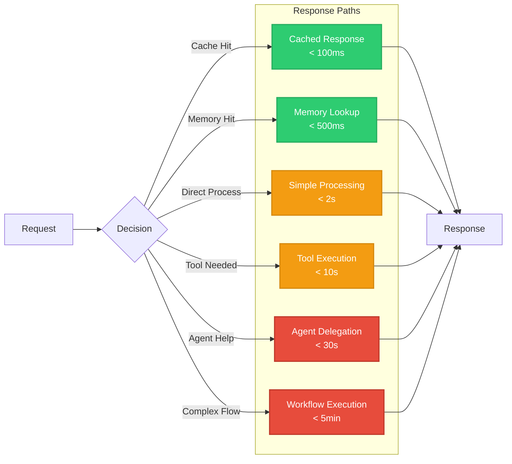

# VividWalls Agent Architecture Diagram

## Introduction

This document illustrates the internal architecture of a typical agent within the VividWalls Multi-Agent System. Each agent follows a standardized architecture pattern that enables autonomous decision-making, tool usage, memory management, and inter-agent communication.

## Agent Architecture Overview

### Core Agent Components

## Detailed Component Breakdown

### 1. Input Processing Pipeline

### 2. Decision Making Process

### 3. Memory Architecture

### 4. Tool Integration Framework

## Agent Lifecycle

### Agent State Machine

## Communication Patterns

### Inter-Agent Communication

## Example: Marketing Director Agent

### Specific Implementation

## Performance Optimization

### Agent Response Flow

## Security & Governance

### Agent Security Model

## Summary

The VividWalls agent architecture provides:

- **Modularity**: Standardized components across all agents
- **Scalability**: Efficient memory and tool management
- **Intelligence**: Sophisticated decision-making capabilities
- **Reliability**: Error handling and recovery mechanisms
- **Security**: Role-based permissions and audit trails
- **Performance**: Optimized response paths for different scenarios

Each agent in the system follows this architecture while specializing in their domain-specific functions, enabling the autonomous operation of the entire VividWalls e-commerce platform.