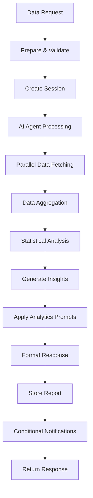

# Data Analytics Agent Workflow Configuration

## Overview
The Data Analytics Agent is a comprehensive n8n workflow that serves as the single source of truth for all VividWalls business performance data. It provides centralized data access, real-time analytics, historical analysis, and actionable insights to all agents in the Multi-Agent System.

## Workflow Components

### 1. Triggers (Entry Points)
- **Webhook Trigger**: `POST /webhook/data-analytics-agent`
- **Workflow Trigger**: Called by other workflows for data requests
- **Daily Analytics Schedule**: Automated daily analytics at 6 AM

### 2. Core AI Agent
- **Model**: GPT-4o with temperature 0.3 for analytical precision
- **Memory**: PostgreSQL-based session management
- **Focus**: Data aggregation, analysis, and insight generation
- **System Prompt**: Specialized for centralized analytics and reporting

### 3. MCP Tool Integrations

#### Data Source MCP Servers
- **Shopify MCP**: E-commerce metrics (sales, inventory, customers)
- **Stripe MCP**: Financial transaction data and payment analytics
- **Marketing Aggregator**: Cross-channel marketing performance
- **Supabase MCP**: Business data and historical reports
- **ListMonk MCP**: Email campaign analytics
- **Neo4j MCP**: Graph analytics and relationship mapping

#### Analytics MCP Servers
- **Data Analytics Prompts**: Specialized analysis templates
- **Data Analytics Resource**: Pre-computed KPIs and summaries
- **Analytics Director Prompts**: Advanced methodologies
- **Analytics Director Resource**: Strategic insights and benchmarks

### 4. Data Processing Pipeline



## Input Schema

```json
{
  "trigger_source": "agent_name or scheduled",
  "request_type": "dashboard | metrics | analysis | forecast",
  "data_requirements": {
    "metrics": ["revenue", "customers", "operations", "marketing"],
    "dimensions": ["time", "segment", "channel", "product"],
    "granularity": "hourly | daily | weekly | monthly",
    "aggregations": ["sum", "avg", "count", "min", "max"]
  },
  "timeframe": {
    "period": "last_30_days | last_quarter | custom",
    "startDate": "ISO date",
    "endDate": "ISO date",
    "comparison": "previous_period | year_over_year"
  },
  "analysisParameters": {
    "includeForecasts": true,
    "includeSegmentation": true,
    "includeAnomalies": true,
    "confidenceLevel": 0.95
  },
  "urgency": "immediate | standard | low"
}
```

## Output Schema

```json
{
  "responseType": "analytics_report",
  "responseId": "resp_analytics_[timestamp]",
  "sessionId": "analytics_session_id",
  "requestType": "dashboard | metrics | analysis",
  "status": "completed",
  
  "executiveSummary": {
    "overallHealth": 85,
    "keyHighlights": [
      "Revenue growth of 12.5%",
      "156 new customers acquired",
      "Positive trend across key metrics"
    ],
    "criticalAlerts": [],
    "recommendations": [
      {
        "area": "Customer Retention",
        "action": "Implement retention campaign",
        "impact": "high",
        "effort": "medium"
      }
    ]
  },
  
  "performanceMetrics": {
    "kpis": {
      "revenue": {
        "total": 250000,
        "growth": 0.125,
        "avgOrderValue": 185
      },
      "customers": {
        "total": 5432,
        "new": 156,
        "retention": 0.82,
        "lifetime_value": 1250
      },
      "operations": {
        "orderFulfillment": 0.97,
        "inventoryTurnover": 4.2,
        "costPerOrder": 12.50
      },
      "marketing": {
        "roi": 4.2,
        "cac": 45,
        "conversionRate": 0.032
      }
    },
    "periodComparison": {
      "change": "positive",
      "percentage": 5.2
    },
    "benchmarks": {
      "revenue_growth": {
        "industry": 0.15,
        "ours": 0.125
      }
    }
  },
  
  "insights": {
    "trends": {
      "identified": ["growth", "seasonality"],
      "significance": "significant",
      "projections": {
        "next30Days": 275000,
        "confidence": 0.75
      }
    },
    "anomalies": {
      "detected": [],
      "severity": [],
      "actions": []
    },
    "segments": {
      "analysis": {},
      "opportunities": [],
      "recommendations": []
    }
  },
  
  "dataQuality": {
    "score": 0.95,
    "completeness": 0.98,
    "sources": ["shopify", "stripe", "marketing", "supabase"],
    "lastUpdated": "ISO timestamp"
  }
}
```

## Data Domains Coverage

### Sales & Revenue Analytics
- Total revenue tracking
- Order volume and AOV
- Product performance metrics
- Channel attribution
- Conversion funnel analysis

### Marketing Performance
- Campaign effectiveness across channels
- Customer acquisition costs (CAC)
- Marketing ROI by channel
- Engagement metrics
- Lead generation metrics

### Customer Analytics
- Segmentation analysis
- Lifetime value (LTV) calculations
- Retention and churn rates
- Purchase behavior patterns
- Satisfaction metrics

### Operational Metrics
- Inventory turnover rates
- Fulfillment efficiency
- Production costs
- Supplier performance
- Operational expenses

### Financial Health
- Profit margins by product/category
- Cash flow analysis
- Budget vs. actual
- Financial projections
- Cost center analysis

## Analytics Features

### Real-time Processing
- Live data fetching from multiple sources
- Parallel processing for efficiency
- Sub-second response for cached metrics
- Automatic data refresh cycles

### Advanced Analysis
- **Trend Detection**: Identifies patterns and trajectories
- **Anomaly Detection**: Flags unusual variations (>15% deviation)
- **Forecasting**: Predictive analytics with confidence intervals
- **Segmentation**: Multi-dimensional customer and product analysis
- **Benchmarking**: Industry comparison and competitive positioning

### Quality Assurance
- Data validation and cleansing
- Confidence scoring for all metrics
- Source attribution and traceability
- Completeness checking
- Anomaly flagging

## Integration Points

### Incoming Requests From
- **Business Manager**: Executive dashboards and KPIs
- **Marketing Director**: Campaign performance analytics
- **Sales Director**: Pipeline and conversion metrics
- **Operations Director**: Efficiency and fulfillment data
- **Finance Director**: Financial performance analysis
- **All Agents**: Ad-hoc data requests

### Outgoing Notifications To
- **Analytics Director**: Urgent analytics and anomalies
- **Business Manager**: Critical alerts (health score <70)
- **Requesting Agents**: Completed analysis responses

## Automated Features

### Daily Analytics Generation
- Runs automatically at 6 AM daily
- Generates comprehensive KPI dashboard
- Performs trend analysis
- Detects anomalies
- Creates executive summary

### Alert Thresholds
- Health score <70: Alert Business Manager
- Anomaly detected: Notify Analytics Director
- Critical metric deviation >30%: Immediate escalation
- Data quality <90%: Flag for investigation

### Caching Strategy
- Real-time metrics: No caching
- Historical data: 24-hour cache
- Computed KPIs: 1-hour cache
- Forecasts: 6-hour cache

## Performance Optimization

### Parallel Processing
- Simultaneous data fetching from all sources
- Concurrent analysis operations
- Batch processing for large datasets
- Optimized query execution

### Resource Management
- Connection pooling for databases
- Rate limiting for external APIs
- Memory optimization for large datasets
- Query result caching

## Error Handling

### Retry Logic
- API failures: 3 retries with exponential backoff
- Database timeouts: Fallback to cached data
- Invalid data: Validation and cleansing
- Missing sources: Partial response with warnings

### Fallback Strategies
- Use cached data when sources unavailable
- Provide partial analytics when possible
- Include data quality indicators
- Log all errors for debugging

## Security & Compliance

### Data Protection
- Encrypted data transmission
- Secure credential storage
- Access control by agent role
- Audit logging for all requests

### Compliance Standards
- GDPR-compliant data handling
- PII anonymization
- Data retention policies
- Regular security audits

## Testing & Validation

### Test Mode Configuration
```json
{
  "test_mode": true,
  "use_mock_data": true,
  "limited_sources": ["shopify"],
  "skip_notifications": true
}
```

### Validation Checklist
- [ ] All MCP servers authenticated
- [ ] Database connections verified
- [ ] Session management working
- [ ] Data aggregation accurate
- [ ] Analytics calculations correct
- [ ] Notification routing functional

## Deployment

### Environment Variables Required
```bash
OPENAI_API_KEY=[api_key]
SHOPIFY_ACCESS_TOKEN=[token]
STRIPE_API_KEY=[api_key]
POSTGRES_CONNECTION=[connection_string]
SUPABASE_URL=[url]
SUPABASE_KEY=[key]
N8N_WEBHOOK_URL=[webhook_base_url]
```

### Activation Steps
1. Import workflow JSON into n8n
2. Configure all MCP server credentials
3. Set up PostgreSQL tables for sessions and reports
4. Test with sample data request
5. Verify all data sources responding
6. Enable workflow and schedule triggers

## Performance Metrics

### Response Times
- Simple metrics: <2 seconds
- Dashboard generation: <5 seconds
- Complex analysis: <10 seconds
- Full report: <15 seconds

### Accuracy Standards
- Data accuracy: >99%
- Forecast accuracy: >85%
- Anomaly detection: >90% precision
- Segmentation accuracy: >95%

## Troubleshooting

### Common Issues
1. **No data returned**: Check MCP server credentials
2. **Slow response**: Verify parallel processing enabled
3. **Incorrect metrics**: Validate calculation logic
4. **Missing forecasts**: Ensure sufficient historical data
5. **Alert not sent**: Check notification thresholds

### Debug Mode
Enable verbose logging:
```json
{
  "debug": true,
  "log_level": "verbose",
  "trace_mcp_calls": true,
  "log_calculations": true
}
```

## Version History
- v1.0: Initial implementation with core analytics
- v1.1: Added forecasting capabilities
- v1.2: Enhanced anomaly detection
- v1.3: Implemented segmentation analysis
- v1.4: Added automated daily generation
- v1.5: Integrated all MCP data sources (current)

## Best Practices

1. **Request Optimization**
   - Batch multiple metric requests
   - Use appropriate granularity
   - Leverage caching for historical data

2. **Data Quality**
   - Always check completeness scores
   - Verify source attribution
   - Monitor confidence levels

3. **Performance**
   - Use parallel fetching
   - Implement proper caching
   - Optimize query complexity

4. **Integration**
   - Standardize request formats
   - Handle partial responses gracefully
   - Implement proper error handling