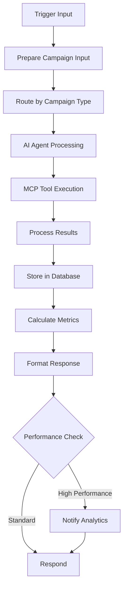

# Email Marketing Agent Workflow Configuration

## Overview
The Email Marketing Agent is a comprehensive n8n workflow that integrates ListMonk for email campaign management and Linear for project tracking. It handles end-to-end email marketing operations including campaign creation, audience segmentation, content management, scheduling, execution, and performance tracking.

## Workflow Components

### 1. Triggers (Entry Points)
- **Webhook Trigger**: `POST /webhook/email-marketing-agent`
- **Chat Trigger**: Interactive chat interface for campaign management
- **Workflow Trigger**: Can be called by other workflows (Marketing Director)
- **Schedule Trigger**: Weekly campaign review (Mondays at 9 AM)

### 2. Core AI Agent
- **Model**: GPT-4o with temperature 0.3 for consistent outputs
- **Memory**: PostgreSQL-based conversation memory per campaign session
- **Knowledge Base**: Vector store with email marketing best practices
- **System Prompt**: Specialized for VividWalls email marketing operations

### 3. MCP Tool Integrations

#### ListMonk Tools
- **Create Campaign**: Design and launch email campaigns
- **Manage Subscribers**: Add, update, and segment email lists
- **Campaign Analytics**: Track open rates, clicks, and conversions
- **List Management**: Organize subscribers into targeted segments

#### Linear Tools
- **Create Task**: Generate campaign project tasks
- **Track Progress**: Monitor campaign development stages
- **Team Collaboration**: Coordinate with marketing team members
- **Sprint Planning**: Align campaigns with marketing sprints

#### Shopify Integration
- **Customer Segments**: Retrieve VIP, regular, new, and abandoned cart segments
- **Purchase History**: Personalize emails based on buying behavior
- **Product Recommendations**: Dynamic content based on preferences

### 4. Data Flow



## Input Schema

```json
{
  "trigger_source": "agent_name or human_user",
  "campaign_type": "promotional | nurture | transactional | automated_flow",
  "campaign_details": {
    "name": "campaign identifier",
    "objective": "sales | engagement | retention | education",
    "target_segment": {
      "criteria": ["purchase_history", "engagement_level", "demographics"],
      "size": "estimated recipients",
      "exclusions": ["unsubscribed", "bounced", "recent_purchasers"]
    }
  },
  "email_content": {
    "subject_line": "email subject",
    "preview_text": "preview snippet",
    "template": "promotional | newsletter | announcement | minimal",
    "personalization": {
      "merge_tags": ["first_name", "last_purchase", "preferences"],
      "dynamic_content": "product_recommendations | content_blocks",
      "behavioral_triggers": ["browsing_history", "cart_contents"]
    }
  },
  "scheduling": {
    "send_time": "immediate | scheduled | triggered",
    "timezone": "recipient | fixed",
    "frequency": "one_time | recurring | event_based",
    "automation_rules": {
      "trigger": "sign_up | purchase | abandonment | anniversary",
      "delay": "time before sending",
      "conditions": ["additional criteria"]
    }
  }
}
```

## Output Schema

```json
{
  "response_type": "email_campaign_execution",
  "response_id": "resp_email_[timestamp]",
  "directive_id": "campaign_session_id",
  "status": "campaign_created | campaign_planned",
  "campaign_details": {
    "campaign_id": "listmonk_campaign_id",
    "listmonk_url": "campaign_management_url",
    "linear_project": "project_tracking_id",
    "subscriber_count": 1500
  },
  "metrics": {
    "estimated_reach": 1500,
    "estimated_opens": 375,
    "estimated_clicks": 45,
    "estimated_conversions": 30,
    "estimated_revenue": 4500,
    "cost_per_email": 0.002,
    "total_cost": 3,
    "roi_estimate": "149900.00"
  },
  "performance_forecast": {
    "best_case": {
      "open_rate": 0.35,
      "click_rate": 0.05,
      "conversion_rate": 0.035,
      "revenue": 6750
    },
    "worst_case": {
      "open_rate": 0.15,
      "click_rate": 0.015,
      "conversion_rate": 0.01,
      "revenue": 2250
    },
    "likely_case": {
      "open_rate": 0.25,
      "click_rate": 0.03,
      "conversion_rate": 0.02,
      "revenue": 4500
    }
  },
  "next_steps": [
    "Monitor campaign performance",
    "Prepare A/B test variants",
    "Schedule follow-up campaigns",
    "Analyze engagement metrics"
  ]
}
```

## Database Schema

The workflow uses PostgreSQL tables for campaign tracking:

```sql
CREATE TABLE email_campaigns (
    campaign_id VARCHAR(255) PRIMARY KEY,
    name VARCHAR(255) NOT NULL,
    type VARCHAR(50) NOT NULL,
    status VARCHAR(50) NOT NULL,
    created_at TIMESTAMP DEFAULT NOW(),
    updated_at TIMESTAMP,
    listmonk_id VARCHAR(255),
    linear_project_id VARCHAR(255),
    subscriber_count INTEGER DEFAULT 0,
    metrics JSONB,
    performance_data JSONB
);

CREATE INDEX idx_campaign_status ON email_campaigns(status);
CREATE INDEX idx_campaign_created ON email_campaigns(created_at);
CREATE INDEX idx_campaign_type ON email_campaigns(type);
```

## Campaign Types

### 1. Promotional Campaigns
- Product launches
- Seasonal sales
- Limited-time offers
- Flash sales

### 2. Nurture Campaigns
- Welcome series
- Educational content
- Customer onboarding
- Re-engagement

### 3. Transactional Emails
- Order confirmations
- Shipping notifications
- Account updates
- Password resets

### 4. Automated Flows
- Abandoned cart recovery
- Post-purchase follow-up
- Birthday/anniversary
- Win-back campaigns

## Performance Monitoring

### Key Metrics Tracked
- **Open Rate**: Target > 25%
- **Click-Through Rate**: Target > 3%
- **Conversion Rate**: Target > 2%
- **Unsubscribe Rate**: Target < 0.5%
- **Revenue per Email**: Tracked per campaign
- **List Growth Rate**: Monthly tracking

### Automated Actions
- Campaigns with open rates < 15% are paused
- High-performing campaigns trigger Analytics Director notification
- Weekly performance reviews auto-generate optimization recommendations
- Action items are escalated to Marketing Director when needed

## Error Handling

### Retry Logic
- Failed API calls: 3 retries with exponential backoff
- Database connection issues: Automatic reconnection
- MCP server timeouts: Fallback to queued processing

### Validation Rules
- Email addresses verified before adding to lists
- Duplicate detection prevents multiple sends
- Unsubscribe list checked before campaign launch
- Content validated for spam triggers

## Integration Points

### Incoming Webhooks
- Marketing Director delegation
- Business Manager directives
- Customer service escalations
- Product launch notifications

### Outgoing Notifications
- Analytics Director: Performance metrics
- Marketing Director: Optimization needs
- Customer Experience: Engagement insights
- Finance Director: ROI reports

## Security & Compliance

### Data Protection
- PII encrypted in database
- Secure API key storage
- Audit logging for all operations
- GDPR-compliant unsubscribe handling

### Email Regulations
- CAN-SPAM compliance
- GDPR consent management
- Unsubscribe link in all emails
- Physical address included

## Testing & Validation

### Test Mode
Set `test_mode: true` in input to:
- Send to test list only
- Use sandbox API endpoints
- Generate mock metrics
- Skip database writes

### Validation Checklist
- [ ] ListMonk API connection verified
- [ ] Linear workspace configured
- [ ] Database tables created
- [ ] Test email sent successfully
- [ ] Webhook endpoints active
- [ ] Performance thresholds set

## Deployment

### Environment Variables Required
```bash
LISTMONK_URL=https://listmonk.vividwalls.blog
LISTMONK_USERNAME=admin
LISTMONK_PASSWORD=[secure_password]
LINEAR_API_KEY=[api_key]
SHOPIFY_ACCESS_TOKEN=[token]
POSTGRES_CONNECTION=[connection_string]
```

### Activation Steps
1. Import workflow JSON into n8n
2. Configure credentials for all integrations
3. Create database tables
4. Test with sample campaign
5. Enable workflow
6. Configure webhook URLs in external systems

## Troubleshooting

### Common Issues
1. **Campaign not created**: Check ListMonk API credentials
2. **No subscribers found**: Verify list IDs and segments
3. **Linear task missing**: Ensure team ID is correct
4. **Metrics not updating**: Check database connection
5. **Webhooks not triggering**: Verify URL and authentication

### Debug Mode
Enable debug logging by setting:
```json
{
  "debug": true,
  "log_level": "verbose"
}
```

## Performance Optimization

### Caching Strategy
- Subscriber segments cached for 1 hour
- Template content cached for 24 hours
- Metrics aggregated hourly
- Knowledge base indexed weekly

### Scaling Considerations
- Batch subscriber imports (1000 per batch)
- Async campaign processing for large lists
- Queue management for peak times
- Database connection pooling

## Version History
- v1.0: Initial implementation with ListMonk and Linear
- v1.1: Added Shopify customer segmentation
- v1.2: Enhanced performance forecasting
- v1.3: Automated weekly reviews
- v1.4: A/B testing capabilities (planned)