# Database Relationships and Entity Relationship Diagram

## Overview

This document details all relationships in the simplified VividWalls database schema, including foreign keys, cascading rules, and cardinality.

## Entity Relationship Diagram

```mermaid
erDiagram
    %% Agent System
    agents ||--o{ agents : "parent_id"
    agents ||--o{ agent_capabilities : "has"
    agents ||--o{ agent_collaborations : "requests"
    agents ||--o{ agent_collaborations : "responds"
    
    %% Goals and Workflows
    agents ||--o{ goals : "owns"
    goals ||--o{ goals : "parent_goal"
    goals ||--o{ workflows : "achieved_by"
    agents ||--o{ workflows : "owns"
    workflows ||--o{ workflow_executions : "executed"
    workflow_executions ||--o{ tasks : "contains"
    agents ||--o{ tasks : "assigned_to"
    
    %% Products and Commerce
    products ||--o{ product_variants : "has"
    product_variants ||--o{ order_items : "ordered"
    product_variants ||--o{ inventory : "tracked"
    products ||--o{ product_metrics : "measured"
    customers ||--o{ orders : "places"
    orders ||--o{ order_items : "contains"
    
    %% Customers and Segmentation
    customers ||--o{ customer_segment_members : "belongs_to"
    customer_segments ||--o{ customer_segment_members : "has"
    customers ||--o{ customer_interactions : "interacts"
    agents ||--o{ customer_interactions : "handles"
    
    %% Marketing
    goals ||--o{ campaigns : "drives"
    agents ||--o{ campaigns : "owns"
    customer_segments ||--o{ campaigns : "targets"
    campaigns ||--o{ content : "uses"
    agents ||--o{ content : "creates"
    email_lists ||--o{ email_subscribers : "has"
    customers ||--o{ email_subscribers : "subscribes"
    
    %% Analytics
    agents ||--o{ kpis : "owns"
    kpis ||--o{ kpi_measurements : "measured"
    agents ||--o{ reports : "creates"
    
    %% Financial
    orders ||--o{ transactions : "generates"
    customers ||--o{ transactions : "involved_in"
    agents ||--o{ transactions : "processes"
    agents ||--o{ budgets : "manages"
    transactions ||--o{ revenue_attribution : "attributed"
    agents ||--o{ revenue_attribution : "credited"
    campaigns ||--o{ revenue_attribution : "drives"
    
    %% System
    agents ||--o{ system_events : "generates"
    agents ||--o{ configurations : "updates"
```



## Detailed Relationships

### 1. Agent System Relationships

#### agents (self-referential)
```sql
-- Hierarchical relationship
FOREIGN KEY (parent_id) REFERENCES agents(id)
-- Allows NULL for top-level orchestrator
-- No CASCADE DELETE - preserve hierarchy
```

#### agent_capabilities
```sql
FOREIGN KEY (agent_id) REFERENCES agents(id) ON DELETE CASCADE
-- When agent deleted, remove all capabilities
-- One agent has many capabilities
```

#### agent_collaborations
```sql
FOREIGN KEY (requesting_agent_id) REFERENCES agents(id) ON DELETE CASCADE
FOREIGN KEY (responding_agent_id) REFERENCES agents(id) ON DELETE CASCADE
-- Defines allowed collaboration patterns
-- Many-to-many relationship between agents
```

### 2. Goal and Workflow Relationships

#### goals
```sql
FOREIGN KEY (owner_agent_id) REFERENCES agents(id)
FOREIGN KEY (parent_goal_id) REFERENCES goals(id)
-- Hierarchical goal structure
-- Goals can exist without owners (company-wide)
```

#### workflows
```sql
FOREIGN KEY (goal_id) REFERENCES goals(id)
FOREIGN KEY (owner_agent_id) REFERENCES agents(id) NOT NULL
-- Workflows must have an owner
-- Can be linked to goals (optional)
```

#### workflow_executions
```sql
FOREIGN KEY (workflow_id) REFERENCES workflows(id) ON DELETE RESTRICT
-- Preserve execution history
-- One workflow has many executions
```

#### tasks
```sql
FOREIGN KEY (workflow_execution_id) REFERENCES workflow_executions(id) ON DELETE CASCADE
FOREIGN KEY (assigned_agent_id) REFERENCES agents(id) NOT NULL
-- Tasks deleted with execution
-- Must be assigned to an agent
```

### 3. Product and Commerce Relationships

#### product_variants
```sql
FOREIGN KEY (product_id) REFERENCES products(id) ON DELETE CASCADE
-- Variants deleted with product
-- One product has many variants
```

#### orders
```sql
FOREIGN KEY (customer_id) REFERENCES customers(id)
-- Orders preserved if customer deleted
-- One customer has many orders
```

#### order_items
```sql
FOREIGN KEY (order_id) REFERENCES orders(id) ON DELETE CASCADE
FOREIGN KEY (product_variant_id) REFERENCES product_variants(id)
-- Items deleted with order
-- Preserve items if variant deleted
```

#### inventory
```sql
FOREIGN KEY (product_variant_id) REFERENCES product_variants(id) ON DELETE CASCADE
UNIQUE (product_variant_id, location)
-- One variant per location
-- Inventory deleted with variant
```

#### product_metrics
```sql
FOREIGN KEY (product_id) REFERENCES products(id) ON DELETE CASCADE
UNIQUE (product_id, period_start, period_end)
-- One metric per product per period
-- Metrics deleted with product
```

### 4. Customer and Segmentation Relationships

#### customer_segment_members
```sql
PRIMARY KEY (customer_id, segment_id)
FOREIGN KEY (customer_id) REFERENCES customers(id) ON DELETE CASCADE
FOREIGN KEY (segment_id) REFERENCES customer_segments(id) ON DELETE CASCADE
-- Many-to-many relationship
-- Membership deleted if either side deleted
```

#### customer_interactions
```sql
FOREIGN KEY (customer_id) REFERENCES customers(id) ON DELETE CASCADE
FOREIGN KEY (agent_id) REFERENCES agents(id)
-- Interactions deleted with customer
-- Preserve if agent deleted
```

### 5. Marketing Relationships

#### campaigns
```sql
FOREIGN KEY (goal_id) REFERENCES goals(id)
FOREIGN KEY (owner_agent_id) REFERENCES agents(id)
FOREIGN KEY (target_segment_id) REFERENCES customer_segments(id)
-- All relationships optional
-- Campaigns can exist independently
```

#### content
```sql
FOREIGN KEY (created_by_agent_id) REFERENCES agents(id)
FOREIGN KEY (campaign_id) REFERENCES campaigns(id) ON DELETE SET NULL
-- Content preserved if campaign deleted
-- Track creator agent
```

#### email_subscribers
```sql
PRIMARY KEY (email, list_id)
FOREIGN KEY (list_id) REFERENCES email_lists(id) ON DELETE CASCADE
FOREIGN KEY (customer_id) REFERENCES customers(id) ON DELETE SET NULL
-- Subscriber deleted if list deleted
-- Preserve subscription if customer deleted
```

### 6. Analytics Relationships

#### kpis
```sql
FOREIGN KEY (owner_agent_id) REFERENCES agents(id)
-- KPIs can exist without owner
-- System-wide KPIs
```

#### kpi_measurements
```sql
FOREIGN KEY (kpi_id) REFERENCES kpis(id) ON DELETE CASCADE
-- Measurements deleted with KPI
-- Time-series data
```

#### reports
```sql
FOREIGN KEY (created_by_agent_id) REFERENCES agents(id)
-- Track report creator
-- Reports preserved if agent deleted
```

### 7. Financial Relationships

#### transactions
```sql
FOREIGN KEY (order_id) REFERENCES orders(id)
FOREIGN KEY (customer_id) REFERENCES customers(id)
FOREIGN KEY (agent_id) REFERENCES agents(id)
-- All optional for flexibility
-- Support various transaction types
```

#### budgets
```sql
FOREIGN KEY (owner_agent_id) REFERENCES agents(id)
UNIQUE (category, fiscal_year, fiscal_month)
-- One budget per category per period
-- Can exist without owner
```

#### revenue_attribution
```sql
FOREIGN KEY (transaction_id) REFERENCES transactions(id) ON DELETE CASCADE
FOREIGN KEY (agent_id) REFERENCES agents(id) NOT NULL
FOREIGN KEY (campaign_id) REFERENCES campaigns(id)
-- Attribution deleted with transaction
-- Must credit an agent
```

### 8. System Relationships

#### system_events
```sql
FOREIGN KEY (source_agent_id) REFERENCES agents(id)
-- Track event source
-- Events preserved if agent deleted
```

#### configurations
```sql
FOREIGN KEY (updated_by_agent_id) REFERENCES agents(id)
-- Track who updated config
-- Configs preserved if agent deleted
```

## Cardinality Summary

| Relationship | Type | Description |
|--------------|------|-------------|
| Agent → Agent | 1:N | Hierarchical (parent-child) |
| Agent → Capabilities | 1:N | One agent, many capabilities |
| Agent ↔ Agent | N:N | Collaboration network |
| Goal → Workflows | 1:N | One goal, many workflows |
| Workflow → Executions | 1:N | One workflow, many runs |
| Execution → Tasks | 1:N | One execution, many tasks |
| Product → Variants | 1:N | One product, many sizes/types |
| Customer → Orders | 1:N | One customer, many orders |
| Order → Items | 1:N | One order, many items |
| Customer ↔ Segments | N:N | Many-to-many membership |
| Campaign → Content | 1:N | One campaign, many content pieces |
| Email List ↔ Customers | N:N | Many-to-many subscriptions |
| Transaction → Attribution | 1:N | One transaction, many attributions |

## Referential Integrity Rules

### CASCADE DELETE Rules
- **Always CASCADE**: Child entities that make no sense without parent
  - agent_capabilities, order_items, workflow tasks
  - customer_segment_members (both directions)
  - product_variants with products

### SET NULL Rules
- **Preserve with NULL**: Historical data that should survive
  - campaign_id in content
  - customer_id in email_subscribers
  - agent references in logs/events

### RESTRICT Rules
- **Prevent Deletion**: Critical relationships
  - workflow_id in executions (preserve history)
  - Core entities with dependencies

### NO ACTION Rules
- **Manual Handling**: Complex relationships
  - parent_id in agents (handle hierarchy manually)
  - Cross-department references

## Index Strategy

### Primary Indexes
- All PRIMARY KEY columns automatically indexed
- UUID primary keys for distributed systems

### Foreign Key Indexes
```sql
-- Automatically created for all foreign keys
CREATE INDEX idx_[table]_[column] ON [table]([column]);
```

### Composite Indexes
```sql
-- Frequently queried combinations
CREATE INDEX idx_orders_customer_created ON orders(customer_id, created_at DESC);
CREATE INDEX idx_tasks_agent_status ON tasks(assigned_agent_id, status);
CREATE INDEX idx_products_collection_status ON products(collection, status);
```

### Unique Indexes
```sql
-- Enforce business rules
CREATE UNIQUE INDEX idx_customers_email ON customers(email);
CREATE UNIQUE INDEX idx_agents_name ON agents(name);
CREATE UNIQUE INDEX idx_budgets_category_period ON budgets(category, fiscal_year, fiscal_month);
```

## Data Integrity Constraints

### Check Constraints
```sql
-- Enforce valid values
CHECK (type IN ('orchestrator', 'director', 'specialist'))
CHECK (status IN ('active', 'inactive', 'archived'))
CHECK (amount >= 0)
CHECK (score BETWEEN 0 AND 100)
```

### Default Values
```sql
-- Sensible defaults
DEFAULT gen_random_uuid()
DEFAULT CURRENT_TIMESTAMP
DEFAULT true/false
DEFAULT 0
DEFAULT '{}'::jsonb
```

### Not Null Constraints
- Required fields that ensure data quality
- Foreign keys that must exist
- Business-critical fields

## Performance Considerations

1. **Partition Large Tables**
   - workflow_executions by created_at
   - transactions by transaction_date
   - system_events by created_at

2. **Materialized Views**
   - Customer lifetime value
   - Product performance summaries
   - Agent performance metrics

3. **Query Optimization**
   - Use EXPLAIN ANALYZE
   - Monitor slow queries
   - Regular VACUUM and ANALYZE

This comprehensive relationship design ensures data integrity, supports efficient queries, and maintains flexibility for future growth while keeping the schema simple and maintainable.