# VividWalls Multi-Agent System Database Schema

## Overview

This document describes the complete relational database schema for the VividWalls Multi-Agent System (MAS) implemented in Supabase PostgreSQL. The schema supports agent orchestration, product management, document capture, knowledge embeddings, and research capabilities.

## Database Structure

The database is organized into several logical domains:

1. **Agent System** - Multi-agent hierarchy and configuration
2. **Product Catalog** - E-commerce products and variants
3. **Inventory Management** - Stock tracking and movements
4. **Knowledge Base** - Document embeddings and vector search
5. **Research & Analytics** - Marketing research and reports
6. **Customer Support** - Q&A and knowledge articles

## Entity Relationship Diagram

```mermaid
erDiagram
    %% Agent System Tables
    agents {
        uuid id PK
        varchar name UK
        text role
        text backstory
        text short_term_memory
        text long_term_memory
        text episodic_memory
        uuid parent_agent_id FK
        varchar agent_type
        boolean is_director
        integer hierarchy_level
        varchar department
        varchar team
        jsonb personas
        varchar active_persona
        jsonb persona_knowledge_bases
        boolean supports_personas
        timestamp created_at
        timestamp updated_at
    }
    
    agent_hierarchy {
        uuid id PK
        uuid parent_id FK
        uuid child_id FK
        varchar relationship_type
        timestamp created_at
    }
    
    departments {
        uuid id PK
        varchar name UK
        uuid director_agent_id FK
        text description
        timestamp created_at
    }
    
    teams {
        uuid id PK
        varchar name
        uuid department_id FK
        uuid lead_agent_id FK
        text description
        timestamp created_at
    }
    
    agent_team_membership {
        uuid id PK
        uuid agent_id FK
        uuid team_id FK
        varchar role
        timestamp joined_at
    }
    
    %% Agent Knowledge/Personality Tables
    agent_beliefs {
        uuid id PK
        uuid agent_id FK
        text belief
        timestamp created_at
    }
    
    agent_desires {
        uuid id PK
        uuid agent_id FK
        text desire
        timestamp created_at
    }
    
    agent_intentions {
        uuid id PK
        uuid agent_id FK
        text intention
        timestamp created_at
    }
    
    agent_personalities {
        uuid id PK
        uuid agent_id FK
        varchar openness
        varchar conscientiousness
        varchar extraversion
        varchar agreeableness
        varchar neuroticism
        timestamp created_at
    }
    
    agent_domain_knowledge {
        uuid id PK
        uuid agent_id FK
        varchar vector_database
        varchar knowledge_graph
        timestamp created_at
    }
    
    %% Agent Configuration Tables
    agent_goals {
        uuid id PK
        uuid agent_id FK
        text goal
        varchar priority
        timestamp created_at
    }
    
    agent_objectives {
        uuid id PK
        uuid goal_id FK
        text objective
        boolean is_complete
        timestamp created_at
    }
    
    agent_instructions {
        uuid id PK
        uuid agent_id FK
        text instruction
        integer order_index
        timestamp created_at
    }
    
    agent_rules {
        uuid id PK
        uuid agent_id FK
        text rule
        varchar rule_type
        timestamp created_at
    }
    
    agent_llm_config {
        uuid id PK
        uuid agent_id FK
        varchar model
        float temperature
        integer max_tokens
        jsonb other_params
        timestamp created_at
    }
    
    agent_mcp_tools {
        uuid id PK
        uuid agent_id FK
        varchar tool_name
        varchar tool_type
        jsonb config
        timestamp created_at
    }
    
    %% Product Tables
    products {
        uuid id PK
        varchar handle UK
        varchar title
        text description
        uuid collection_id FK
        uuid category_id FK
        varchar vendor
        varchar product_type
        varchar status
        varchar seo_title
        text seo_description
        text[] tags
        jsonb metadata
        timestamp published_at
        timestamp created_at
        timestamp updated_at
    }
    
    collections {
        uuid id PK
        varchar name UK
        varchar slug UK
        text description
        text theme
        boolean is_featured
        boolean is_active
        integer display_order
        timestamp created_at
        timestamp updated_at
    }
    
    categories {
        uuid id PK
        varchar name UK
        varchar slug UK
        text description
        uuid parent_id FK
        integer display_order
        boolean is_active
        timestamp created_at
        timestamp updated_at
    }
    
    product_variants {
        uuid id PK
        uuid product_id FK
        uuid size_id FK
        uuid print_type_id FK
        varchar sku UK
        varchar barcode
        decimal price
        decimal compare_at_price
        decimal cost_per_item
        integer weight_grams
        boolean requires_shipping
        boolean taxable
        boolean is_active
        timestamp created_at
        timestamp updated_at
    }
    
    product_images {
        uuid id PK
        uuid product_id FK
        text src
        text alt_text
        integer position
        boolean is_primary
        integer width
        integer height
        timestamp created_at
    }
    
    sizes {
        uuid id PK
        varchar name UK
        decimal width_inches
        decimal height_inches
        integer display_order
        boolean is_active
    }
    
    print_types {
        uuid id PK
        varchar name UK
        text description
        varchar production_method
        varchar material
        boolean is_active
    }
    
    %% Inventory Tables
    inventory_levels {
        uuid id PK
        uuid variant_id FK
        uuid location_id FK
        integer available
        integer on_hand
        integer incoming
        integer committed
        timestamp updated_at
    }
    
    inventory_movements {
        uuid id PK
        uuid variant_id FK
        uuid location_id FK
        varchar movement_type
        integer quantity
        varchar reference_type
        varchar reference_id
        text notes
        uuid created_by
        timestamp created_at
    }
    
    locations {
        uuid id PK
        varchar name UK
        varchar code UK
        varchar type
        text address
        boolean is_active
        jsonb metadata
        timestamp created_at
    }
    
    %% Knowledge/Embeddings Tables
    unified_embeddings {
        uuid id PK
        varchar content_type
        uuid content_id
        varchar content_subtype
        varchar source_table
        uuid source_id
        integer chunk_index
        text chunk_text
        vector embedding
        integer token_count
        varchar model_version
        timestamp embedding_created_at
        varchar title
        text description
        text[] tags
        varchar category
        varchar subcategory
        jsonb metadata
        decimal quality_score
        boolean is_active
        timestamp created_at
        timestamp updated_at
    }
    
    crawled_pages {
        bigserial id PK
        varchar url
        integer chunk_number
        text content
        jsonb metadata
        text source_id FK
        vector embedding
        timestamp created_at
    }
    
    sources {
        text source_id PK
        text summary
        integer total_word_count
        timestamp created_at
        timestamp updated_at
    }
    
    research_reports {
        uuid id PK
        timestamp created_at
        timestamp updated_at
        timestamp completed_at
        varchar report_type
        varchar report_scope
        varchar urgency
        varchar status
        varchar title
        text purpose
        jsonb research_focus
        jsonb target_demographics
        jsonb performance_goals
        jsonb methodology
        text executive_summary
        jsonb market_insights
        jsonb consumer_insights
        jsonb competitor_insights
        jsonb trend_analysis
        jsonb recommendations
        jsonb supporting_data
        jsonb agent_metadata
        jsonb workflow_metadata
        text[] sources_analyzed
        decimal confidence_score
        jsonb next_steps
        text keywords[]
        uuid requested_by
        uuid approved_by
    }
    
    %% Q&A Tables
    qa_categories {
        uuid id PK
        varchar name UK
        varchar slug UK
        text description
        varchar icon
        integer display_order
        boolean is_active
    }
    
    qa_entries {
        uuid id PK
        uuid category_id FK
        text question
        text answer
        boolean is_featured
        boolean is_published
        integer view_count
        timestamp created_at
        timestamp updated_at
    }
    
    %% Relationships
    agents ||--o{ agent_hierarchy : "parent"
    agents ||--o{ agent_hierarchy : "child"
    agents ||--o{ departments : "directs"
    agents ||--o{ teams : "leads"
    agents ||--o{ agent_team_membership : "belongs_to"
    agents ||--o{ agent_beliefs : "has"
    agents ||--o{ agent_desires : "has"
    agents ||--o{ agent_intentions : "has"
    agents ||--o{ agent_personalities : "has"
    agents ||--o{ agent_domain_knowledge : "has"
    agents ||--o{ agent_goals : "has"
    agents ||--o{ agent_objectives : "through_goals"
    agents ||--o{ agent_instructions : "has"
    agents ||--o{ agent_rules : "has"
    agents ||--o{ agent_llm_config : "has"
    agents ||--o{ agent_mcp_tools : "has"
    
    departments ||--o{ teams : "contains"
    teams ||--o{ agent_team_membership : "has_members"
    agent_goals ||--o{ agent_objectives : "contains"
    
    products ||--o{ product_variants : "has"
    products ||--o{ product_images : "has"
    products }o--|| collections : "belongs_to"
    products }o--|| categories : "belongs_to"
    
    product_variants }o--|| sizes : "has"
    product_variants }o--|| print_types : "has"
    product_variants ||--o{ inventory_levels : "tracked_at"
    product_variants ||--o{ inventory_movements : "has"
    
    locations ||--o{ inventory_levels : "stores"
    locations ||--o{ inventory_movements : "records"
    
    categories ||--o{ categories : "parent_of"
    
    qa_categories ||--o{ qa_entries : "contains"
    
    sources ||--o{ crawled_pages : "contains"
```

## Table Descriptions

### Agent System Tables

#### agents
Central table storing all agents in the system with their hierarchical relationships and memory systems.
- Supports BDI (Beliefs, Desires, Intentions) architecture
- Hierarchical structure with parent-child relationships
- Persona management for dynamic agent behavior

#### agent_hierarchy
Defines relationships between agents (manages, reports_to, collaborates_with).

#### departments
Organizational units led by director agents.

#### teams
Sub-units within departments for specialized agent groups.

#### agent_team_membership
Many-to-many relationship between agents and teams.

### Agent Knowledge Tables

#### agent_beliefs, agent_desires, agent_intentions
Implements the BDI cognitive architecture for agent reasoning.

#### agent_personalities
Big Five personality traits for agent behavior modeling.

#### agent_domain_knowledge
Links agents to their vector databases and knowledge graphs.

### Agent Configuration Tables

#### agent_goals & agent_objectives
Hierarchical goal system for agent task management.

#### agent_instructions & agent_rules
Operational guidelines and constraints for agent behavior.

#### agent_llm_config
LLM model configuration per agent (model, temperature, tokens).

#### agent_mcp_tools
Model Context Protocol (MCP) tool assignments for agents.

### Product Catalog Tables

#### products
Main product catalog with SEO fields and metadata.

#### collections
Product groupings (e.g., "Chromatic Echoes", "Geometric Intersect").

#### categories
Hierarchical categorization system for products.

#### product_variants
SKU-level items combining product + size + print type.

#### product_images
Multiple images per product with positioning.

#### sizes & print_types
Reference tables for variant options.

### Inventory Management Tables

#### inventory_levels
Current stock levels by variant and location.

#### inventory_movements
Transaction log for all inventory changes.

#### locations
Warehouses, stores, and drop-ship locations.

### Knowledge Base Tables

#### unified_embeddings
Central vector storage for all embedded content.
- Supports multiple content types (product, agent_knowledge, etc.)
- 1536-dimension vectors for OpenAI embeddings
- Metadata and quality scoring

#### crawled_pages
Web-scraped content with chunking and embeddings.

#### sources
Parent records for crawled content sources.

#### research_reports
Comprehensive marketing research storage with structured insights.

### Customer Support Tables

#### qa_categories & qa_entries
Structured Q&A system for customer self-service.

## Key Features

### Vector Search
- pgvector extension enabled for similarity search
- 1536-dimension embeddings (OpenAI standard)
- IVFFlat indexes for performance

### Full-Text Search
- pg_trgm extension for fuzzy text matching
- GIN indexes on JSONB fields
- Array field indexing for tags

### Hierarchical Data
- Self-referential categories
- Agent hierarchy with multiple relationship types
- Team and department structures

### Audit Trail
- created_at/updated_at timestamps on all tables
- Movement logs for inventory
- Version tracking capabilities

## Integration Points

### Neo4j Knowledge Graph
- Agent nodes synchronized via agent_domain_knowledge
- Embeddings can be linked to graph nodes
- Bi-directional sync supported

### n8n Workflows
- Agents table drives workflow orchestration
- Research reports populated by workflows
- MCP tools configured per agent

### MCP Servers
- Tool assignments in agent_mcp_tools
- Crawl4AI integration via crawled_pages
- Vector store access through unified_embeddings

## Performance Considerations

1. **Indexes**: Strategic indexes on foreign keys, unique constraints, and search fields
2. **Partitioning**: Ready for time-based partitioning on large tables
3. **Vector Performance**: IVFFlat indexes with configurable lists parameter
4. **JSONB**: GIN indexes for efficient metadata queries

## Security

- Row-level security (RLS) ready
- UUID primary keys prevent enumeration
- Prepared statement compatibility
- Audit trail on sensitive operations

---

Last Updated: 2025-07-06