# VividWalls Multi-Agent System Organizational & Workflow Structure

## Introduction

This document illustrates the hierarchical organization and workflow patterns of the VividWalls Multi-Agent System (MAS), designed to operate an autonomous e-commerce platform for premium wall art. The system follows a director-based hierarchy with specialized agents managing different business functions, leveraging workflow patterns from Anthropic's agent design principles including routing, parallelization, and orchestrator-worker models.

## Table of Contents

1. [System Overview](#system-overview)
2. [Hierarchical Structure](#hierarchical-structure)
3. [Department Deep Dives](#department-deep-dives)
4. [Workflow Patterns](#workflow-patterns)
5. [Cross-Functional Workflows](#cross-functional-workflows)
6. [External System Integration](#external-system-integration)

## System Overview

### High-Level Architecture

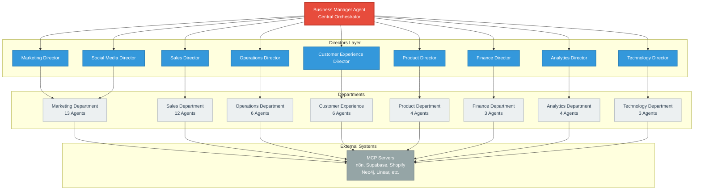

**Key Components:**

- **Business Manager Agent**: Central orchestrator overseeing all operations
- **9 Director / Orchestrator Agents**: Department heads who own end-to-end workflows
- **≈ 57 Total Agents**: 9 Directors (orchestrators) + ~48 Action / Task-oriented agents (includes 12 sales sub-agents)
- **MCP Server Integration**: External tools accessed via `n8n-nodes-mcp` **List / Execute Tool** nodes

## Hierarchical Structure

### Director-Level Organization

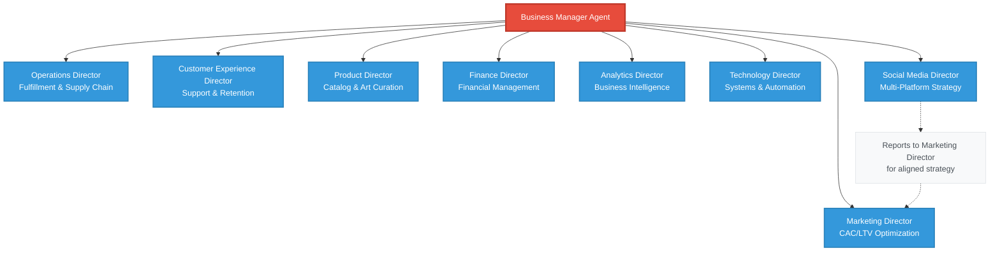

**Annotation:** The Social Media Director reports to both the Business Manager and coordinates closely with the Marketing Director for aligned marketing strategies.

## Department Deep Dives

### Marketing Department Structure

```mermaid
graph TD
    %% Style definitions
    classDef director fill:#3498db,stroke:#2980b9,stroke-width:2px,color:#fff
    classDef specialist fill:#2ecc71,stroke:#27ae60,stroke-width:2px,color:#fff
    classDef taskAgent fill:#f39c12,stroke:#d68910,stroke-width:2px,color:#fff
    classDef annotation fill:#f8f9fa,stroke:#dee2e6,stroke-width:1px,color:#495057

    MD[Marketing Director]:::director
    SMD[Social Media Director]:::director
    
    subgraph Platform Specialists
        FB[Facebook Agent<br/>Ads & Commerce]:::specialist
        IG[Instagram Agent<br/>Visual Content]:::specialist
        PIN[Pinterest Agent<br/>Discovery & Rich Pins]:::specialist
        EM[Email Marketing Agent<br/>Automation & Segmentation]:::specialist
    end
    
    subgraph Content Team
        CW[Copy Writer Agent<br/>Creative Content]:::specialist
        CE[Copy Editor Agent<br/>Quality & SEO]:::specialist
        NL[Newsletter Agent<br/>Editorial Planning]:::specialist
    end
    
    subgraph Task Agents
        MRA[Marketing Research Agent<br/>Market Intelligence]:::taskAgent
        KA[Keyword Agent<br/>SEO Strategy]:::taskAgent
        CCA[Creative Content Agent<br/>Ad Generation]:::taskAgent
        AIA[Audience Intelligence Agent<br/>Segmentation]:::taskAgent
        CAA[Campaign Analytics Agent<br/>ROAS Analysis]:::taskAgent
    end
    
    MD --> FB
    MD --> IG
    MD --> PIN
    MD --> EM
    MD --> CW
    MD --> CE
    MD --> NL
    MD --> MRA
    MD --> KA
    MD --> CCA
    MD --> AIA
    MD --> CAA
    
    SMD --> FB
    SMD --> IG
    SMD --> PIN
    
    CW <--> CE
    
    Note1[Content flows through<br/>editing process]:::annotation
    CW -.-> Note1
    Note1 -.-> CE
    
    Note2[Research informs<br/>all marketing activities]:::annotation
    MRA -.-> Note2
```

**Key Relationships:**

- Platform specialists report to both Marketing Director and Social Media Director
- Content team has internal review process (Writer → Editor)
- Task agents provide intelligence and analytics to inform strategies

### Operations Department Structure

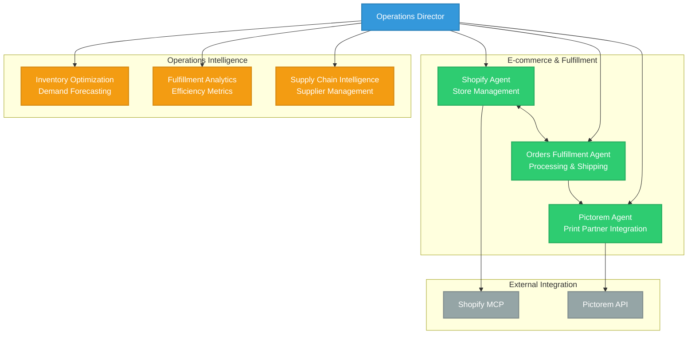

**Workflow Annotation:** Orders flow from Shopify Agent → Orders Fulfillment Agent → Pictorem Agent for print-on-demand production.

### Customer Experience Department

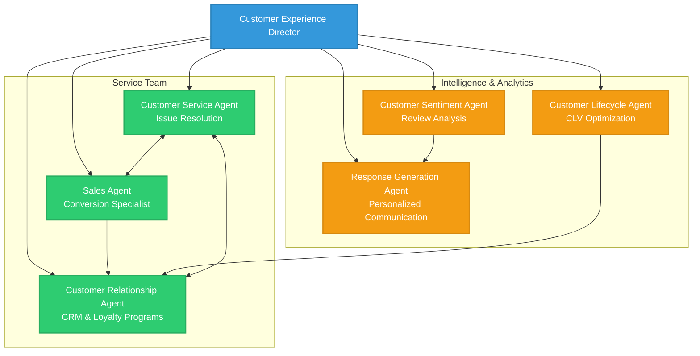

**Service Flow:** Customer inquiries route through Customer Service Agent, escalate to Sales Agent for sales opportunities, and feed into CRM for relationship management.

### Product Department Structure

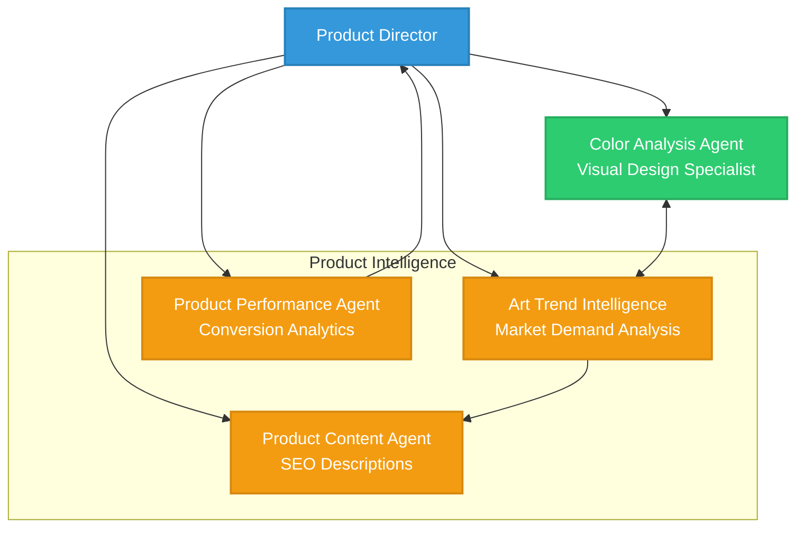

**Analytics Flow:** Art Trend Intelligence informs Color Analysis, which guides Product Content creation.

### Supporting Departments

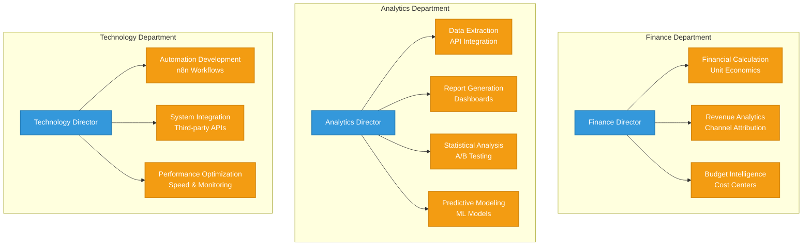

## Workflow Patterns

### 1. Orchestrator-Workers Pattern *(Directors ⇄ Task Agents)*

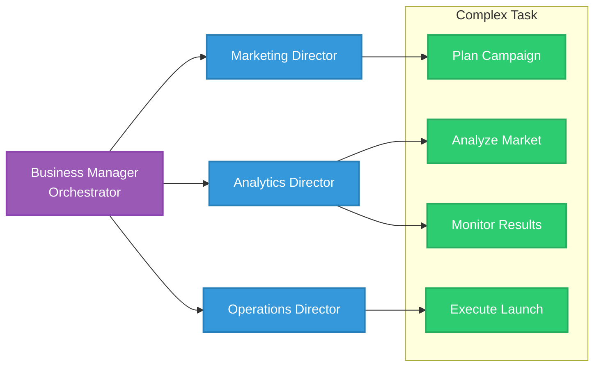

**Example:** New product launch orchestrated by Business Manager, delegated to directors.

```markdown
// n8n MCP-Client node example used by any Task Agent
{
  "type": "n8n-nodes-mcp",
  "action": "executeTool",
  "parameters": {
    "server": "shopify",
    "tool": "get-products"
  }
}
```

### 2. Routing Pattern

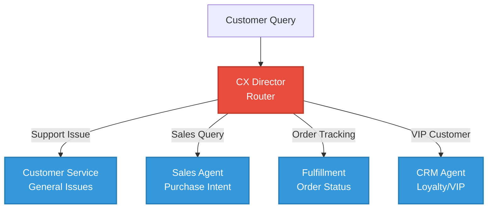

### 3. Parallelization Pattern

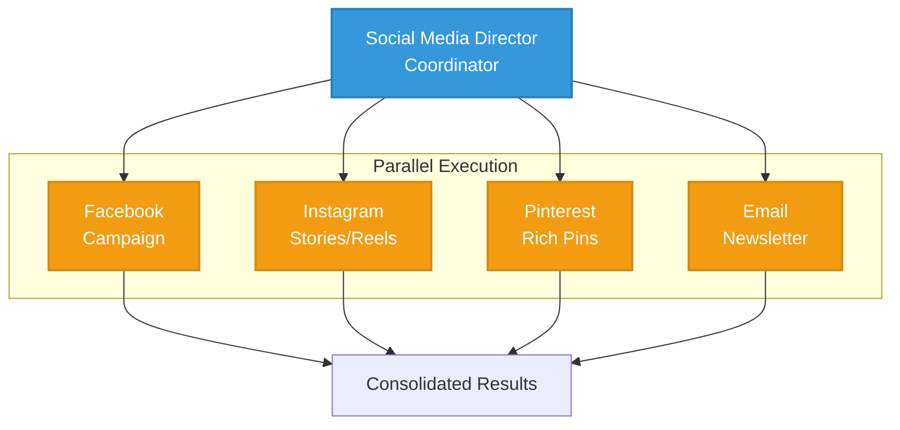

**Use Case:** Multi-channel marketing campaign executed simultaneously across platforms.

### 4. Evaluator-Optimizer Pattern

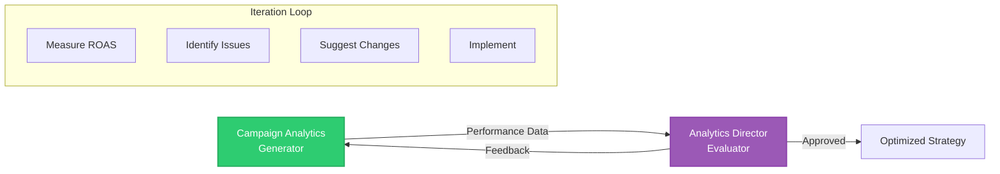

## Cross-Functional Workflows

### New Product Launch Workflow

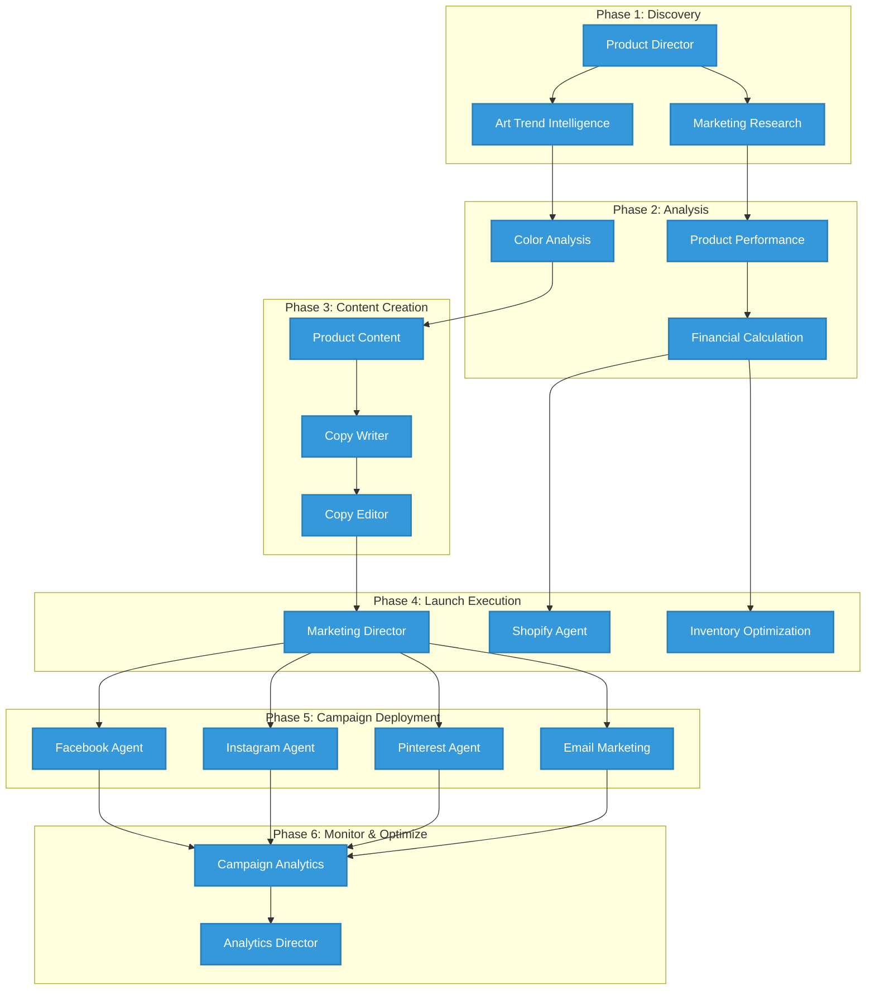

### Customer Order Processing Flow

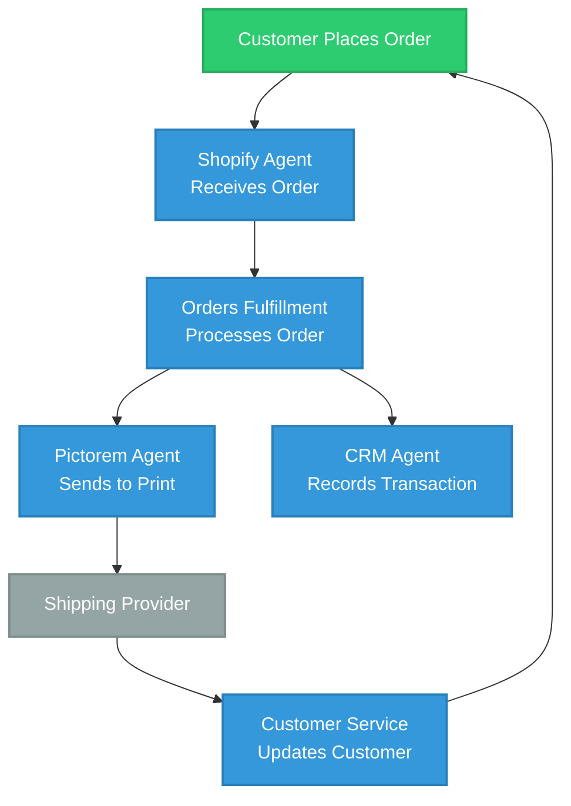

## External System Integration

### MCP Server Integration Map

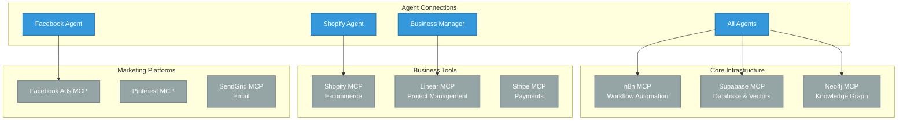

**Integration Notes:**

- All agents use Supabase for data storage and Neo4j for memory
- n8n provides workflow automation backbone
- Platform-specific agents connect to their respective MCP servers
- Business Manager uses Linear for high-level project tracking

## Summary

The VividWalls MAS architecture enables:

- **Scalability**: From $5.7M to $36.5M revenue over 5 years
- **Autonomy**: Self-organizing departments with clear responsibilities
- **Efficiency**: Automated workflows reducing manual intervention
- **Intelligence**: Data-driven decision making across all operations
- **Flexibility**: Modular design allowing easy addition of new agents
- **Resilience**: Comprehensive failure prevention based on MAS research

## Resilience Framework

The system implements advanced resilience patterns to address the 14 failure modes identified in multi-agent system research:

### Failure Prevention
- **Specification Issues (41.77%)**: Clear termination conditions, role specifications
- **Inter-Agent Misalignment (36.94%)**: Message acknowledgments, clarification protocols  
- **Task Verification (21.30%)**: Multi-level verification, consensus mechanisms

### Key Enhancements
1. **Circuit Breakers**: Prevent cascading failures with configurable thresholds
2. **Message Queuing**: Redis/RabbitMQ for reliable communication
3. **Context Management**: Sliding window summarization to prevent information loss
4. **Automated Recovery**: Checkpointing, rollback, and self-healing workflows

For the complete resilience implementation plan, see [PLAN.md](./PLAN.md)

This multi-agent system represents a sophisticated approach to e-commerce automation, leveraging AI agents to handle complex business operations while maintaining human oversight through the Business Manager Agent
