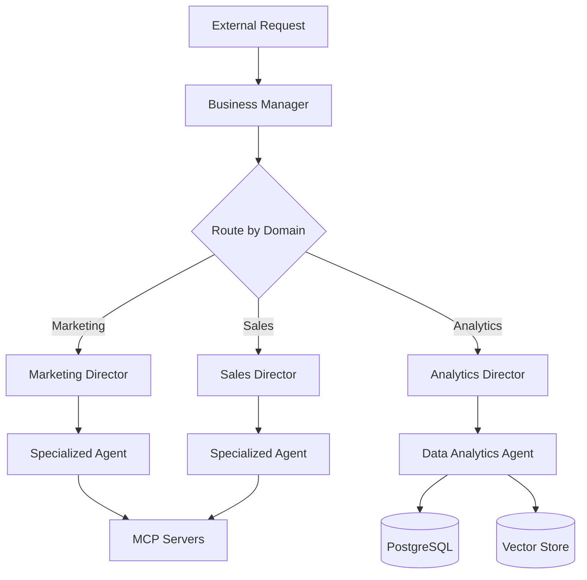

# MAS Workflow Architecture

## System Design

The VividWalls Multi-Agent System implements a hierarchical, event-driven architecture using n8n workflows. This document details the technical architecture and design patterns.

## Core Architecture Principles

### 1. Hierarchical Command Structure
```
Business Manager (Orchestrator)
    ├── Marketing Director
    │   ├── Content Strategy Agent
    │   ├── Campaign Manager Agent
    │   └── 11 other marketing agents
    ├── Sales Director
    │   ├── Lead Qualifier Agent
    │   ├── Quote Generator Agent
    │   └── 10 other sales agents
    └── 7 other Directors
        └── Their specialized agents
```

### 2. Communication Patterns

#### Synchronous Communication
- **Webhook-based**: Real-time requests via HTTP webhooks
- **Execute Workflow**: Direct workflow-to-workflow calls
- **Response Required**: Immediate feedback needed

#### Asynchronous Communication
- **Message Queues**: Redis-based job queues
- **Event Triggers**: Database change notifications
- **Scheduled Tasks**: Cron-based automation

### 3. Data Flow Architecture



## Workflow Components

### 1. Trigger Nodes
- **Webhook Trigger**: External API calls
- **Execute Workflow Trigger**: Internal agent calls
- **Schedule Trigger**: Time-based automation
- **Database Trigger**: Data change events

### 2. Processing Nodes
- **AI Agent Node**: LangChain integration
- **Code Node**: Custom JavaScript logic
- **Router Node**: Conditional branching
- **Loop Node**: Iterative processing

### 3. Integration Nodes
- **MCP Client**: External tool access
- **HTTP Request**: API integrations
- **Database**: PostgreSQL operations
- **Vector Store**: Qdrant operations

### 4. Memory Nodes
- **Postgres Chat Memory**: Conversation history
- **Redis Cache**: Temporary data storage
- **Vector Memory**: Semantic search

## Design Patterns

### 1. Director Pattern
Directors implement a facade pattern, providing simplified interfaces to complex subsystems:

```javascript
// Director receives request
const request = $input.all()[0].json;

// Analyze and route to appropriate specialist
const specialist = determineSpecialist(request);
const context = buildContext(request);

// Delegate to specialist
const result = await $executeWorkflow(specialist, {
    context,
    request,
    directorAuth: true
});

// Aggregate and return
return aggregateResults(result);
```

### 2. Specialist Pattern
Specialists implement focused functionality with deep domain knowledge:

```javascript
// Load specialist configuration
const config = loadSpecialistConfig($input.all()[0].json.specialist_type);

// Apply domain expertise
const analysis = applyDomainKnowledge(request, config);

// Execute specialized tools
const toolResults = await executeMCPTools(analysis.requiredTools);

// Generate specialist response
return generateSpecialistResponse(analysis, toolResults);
```

### 3. Knowledge Gatherer Pattern
Standardized pattern for knowledge extraction and storage:

```javascript
// Configure for specific domain
const domain = $input.all()[0].json.domain || 'marketing';
const config = knowledgeGathererConfigs[domain];

// Extract knowledge using domain patterns
const knowledge = extractDomainKnowledge(content, config.patterns);

// Store in appropriate collections
await storeInVectorDB(knowledge, config.collections);
await updateSupabase(knowledge, config.tables);
```

## Integration Architecture

### 1. MCP Server Integration
```yaml
Tool Servers:
  - shopify-mcp-server: E-commerce operations
  - stripe-mcp-server: Payment processing
  - supabase-mcp-server: Database operations
  - linear-mcp-server: Task management

Prompt Servers:
  - marketing-director-prompts: Marketing templates
  - business-manager-prompts: Executive templates

Resource Servers:
  - marketing-director-resource: Marketing data
  - analytics-resource: Analytics data
```

### 2. Database Architecture
```sql
-- Agent interactions
CREATE TABLE agent_interactions (
    id UUID PRIMARY KEY,
    agent_id VARCHAR(255),
    session_id VARCHAR(255),
    interaction_type VARCHAR(50),
    request JSONB,
    response JSONB,
    metadata JSONB,
    created_at TIMESTAMP DEFAULT NOW()
);

-- Agent knowledge
CREATE TABLE agent_knowledge (
    id UUID PRIMARY KEY,
    agent_id VARCHAR(255),
    domain VARCHAR(100),
    knowledge_type VARCHAR(50),
    content TEXT,
    embeddings VECTOR(1536),
    metadata JSONB,
    created_at TIMESTAMP DEFAULT NOW()
);

-- Workflow executions
CREATE TABLE workflow_executions (
    id UUID PRIMARY KEY,
    workflow_id VARCHAR(255),
    trigger_type VARCHAR(50),
    status VARCHAR(20),
    input_data JSONB,
    output_data JSONB,
    error_data JSONB,
    started_at TIMESTAMP,
    completed_at TIMESTAMP
);
```

### 3. Vector Store Architecture
Collections organized by domain and purpose:
- `marketing_strategies`: Marketing playbooks and tactics
- `customer_segments`: Customer profiles and behaviors
- `product_knowledge`: Product specifications and details
- `sales_playbooks`: Sales strategies and scripts

## Security Architecture

### 1. Authentication
- **API Keys**: External service authentication
- **JWT Tokens**: Internal service communication
- **Role-Based Access**: Director and specialist permissions

### 2. Data Protection
- **Encryption at Rest**: Database encryption
- **Encryption in Transit**: TLS for all communications
- **Credential Management**: n8n credential store

### 3. Access Control
- **Director Authority**: Enhanced permissions for directors
- **Specialist Scope**: Limited to domain operations
- **Audit Logging**: All agent actions logged

## Performance Optimization

### 1. Caching Strategy
- **Redis**: Hot data and session state
- **Vector Store**: Semantic search cache
- **PostgreSQL**: Query result caching

### 2. Parallel Processing
- **Concurrent Workflows**: Multiple agent execution
- **Batch Operations**: Bulk data processing
- **Async Patterns**: Non-blocking operations

### 3. Resource Management
- **Connection Pooling**: Database connections
- **Rate Limiting**: External API calls
- **Queue Management**: Job distribution

## Monitoring and Observability

### 1. Metrics Collection
- **Workflow Metrics**: Execution time, success rate
- **Agent Metrics**: Response time, accuracy
- **System Metrics**: CPU, memory, connections

### 2. Logging Strategy
- **Structured Logging**: JSON format
- **Log Levels**: ERROR, WARN, INFO, DEBUG
- **Centralized Collection**: Aggregated logs

### 3. Alerting Rules
- **Workflow Failures**: Immediate alerts
- **Performance Degradation**: Threshold alerts
- **Resource Exhaustion**: Capacity alerts

## Scalability Considerations

### 1. Horizontal Scaling
- **Stateless Workflows**: No workflow-level state
- **Distributed Execution**: Multi-instance n8n
- **Load Balancing**: Request distribution

### 2. Vertical Scaling
- **Resource Allocation**: CPU/memory per workflow
- **Connection Limits**: Database pool sizing
- **Queue Capacity**: Redis configuration

## Future Architecture Evolution

### 1. Planned Enhancements
- **GraphQL API**: Unified query interface
- **Event Streaming**: Kafka integration
- **ML Pipeline**: Advanced analytics

### 2. Architecture Roadmap
- **Q3 2024**: Microservices migration
- **Q4 2024**: Kubernetes deployment
- **Q1 2025**: Multi-region support

## Best Practices

### 1. Workflow Design
- Keep workflows focused and single-purpose
- Use sub-workflows for reusable logic
- Implement proper error handling
- Add comprehensive logging

### 2. Data Management
- Minimize data passed between nodes
- Use references instead of full objects
- Clean up temporary data
- Implement data retention policies

### 3. Testing Strategy
- Unit tests for code nodes
- Integration tests for workflows
- Load tests for performance
- Chaos tests for resilience