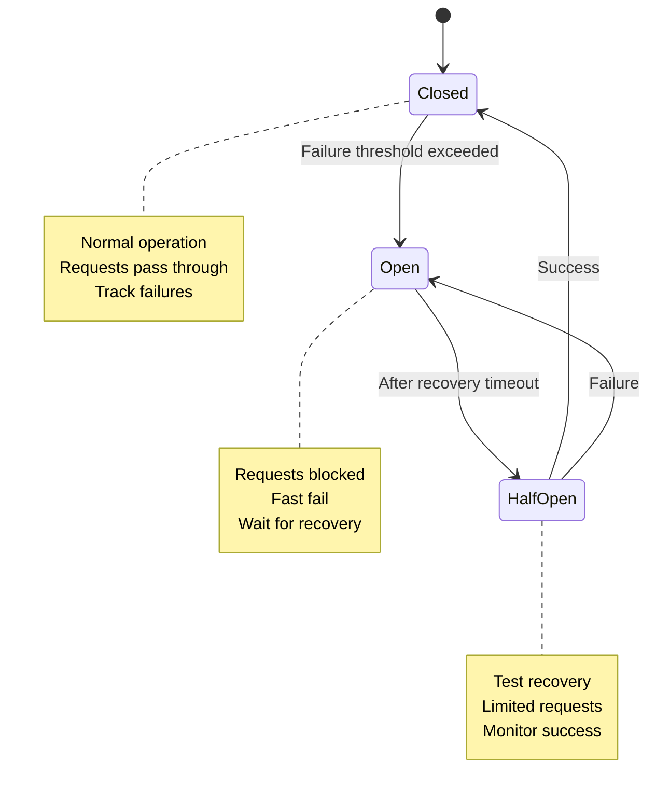

# Circuit Breaker Architecture

## Overview

Circuit breakers prevent cascading failures in the VividWalls MAS by detecting failures and preventing calls to failing services, allowing them time to recover. This addresses error propagation issues identified in the multi-agent systems research.

## Architecture Design

### 1. Circuit Breaker States



### 2. Circuit Breaker Configuration

```yaml
circuit_breaker_defaults:
  failure_threshold: 5          # Failures before opening
  success_threshold: 2          # Successes to close from half-open
  timeout: 60000               # Recovery timeout in ms
  half_open_requests: 3        # Max requests in half-open state
  
agent_specific_configs:
  critical_agents:
    business_manager:
      failure_threshold: 10     # More tolerant
      timeout: 30000           # Faster recovery
    sales_director:
      failure_threshold: 7
      timeout: 45000
      
  platform_agents:
    shopify_agent:
      failure_threshold: 3     # Less tolerant of API failures
      timeout: 120000         # Longer recovery for API limits
    facebook_agent:
      failure_threshold: 3
      timeout: 90000
      
  task_agents:
    default:
      failure_threshold: 5
      timeout: 60000
```

## Implementation

### 1. Circuit Breaker Class

```python
from enum import Enum
from datetime import datetime, timedelta
import asyncio
from typing import Callable, Any, Optional

class CircuitState(Enum):
    CLOSED = "CLOSED"
    OPEN = "OPEN"
    HALF_OPEN = "HALF_OPEN"

class CircuitBreaker:
    def __init__(
        self,
        name: str,
        failure_threshold: int = 5,
        success_threshold: int = 2,
        timeout: int = 60000,
        half_open_requests: int = 3
    ):
        self.name = name
        self.failure_threshold = failure_threshold
        self.success_threshold = success_threshold
        self.timeout = timeout
        self.half_open_requests = half_open_requests
        
        self.state = CircuitState.CLOSED
        self.failure_count = 0
        self.success_count = 0
        self.last_failure_time = None
        self.half_open_count = 0
        
    async def call(self, func: Callable, *args, **kwargs) -> Any:
        """Execute function through circuit breaker"""
        if self.state == CircuitState.OPEN:
            if self._should_attempt_reset():
                self._transition_to_half_open()
            else:
                raise CircuitOpenError(
                    f"Circuit breaker {self.name} is OPEN. "
                    f"Retry after {self._time_until_retry()}ms"
                )
        
        if self.state == CircuitState.HALF_OPEN:
            if self.half_open_count >= self.half_open_requests:
                raise CircuitOpenError(
                    f"Circuit breaker {self.name} is HALF_OPEN. "
                    "Max test requests reached."
                )
            self.half_open_count += 1
        
        try:
            result = await func(*args, **kwargs)
            self._on_success()
            return result
        except Exception as e:
            self._on_failure()
            raise
    
    def _on_success(self):
        """Handle successful execution"""
        self.failure_count = 0
        
        if self.state == CircuitState.HALF_OPEN:
            self.success_count += 1
            if self.success_count >= self.success_threshold:
                self._transition_to_closed()
        
    def _on_failure(self):
        """Handle failed execution"""
        self.failure_count += 1
        self.last_failure_time = datetime.now()
        self.success_count = 0
        
        if self.state == CircuitState.HALF_OPEN:
            self._transition_to_open()
        elif (self.state == CircuitState.CLOSED and 
              self.failure_count >= self.failure_threshold):
            self._transition_to_open()
    
    def _should_attempt_reset(self) -> bool:
        """Check if enough time has passed to try recovery"""
        return (self.last_failure_time and 
                datetime.now() - self.last_failure_time > 
                timedelta(milliseconds=self.timeout))
    
    def _time_until_retry(self) -> int:
        """Calculate milliseconds until retry allowed"""
        if not self.last_failure_time:
            return 0
        elapsed = datetime.now() - self.last_failure_time
        remaining = self.timeout - int(elapsed.total_seconds() * 1000)
        return max(0, remaining)
    
    def _transition_to_open(self):
        """Transition to OPEN state"""
        self.state = CircuitState.OPEN
        self.half_open_count = 0
        self._emit_state_change_event("OPEN")
        
    def _transition_to_closed(self):
        """Transition to CLOSED state"""
        self.state = CircuitState.CLOSED
        self.failure_count = 0
        self.success_count = 0
        self.half_open_count = 0
        self._emit_state_change_event("CLOSED")
        
    def _transition_to_half_open(self):
        """Transition to HALF_OPEN state"""
        self.state = CircuitState.HALF_OPEN
        self.success_count = 0
        self.half_open_count = 0
        self._emit_state_change_event("HALF_OPEN")
    
    def _emit_state_change_event(self, new_state: str):
        """Emit monitoring event for state change"""
        # Integration with monitoring system
        event = {
            "circuit_breaker": self.name,
            "state_change": new_state,
            "timestamp": datetime.now().isoformat(),
            "failure_count": self.failure_count,
            "metrics": self.get_metrics()
        }
        # Send to monitoring system
        asyncio.create_task(self._send_to_monitoring(event))

class CircuitOpenError(Exception):
    """Raised when circuit breaker is open"""
    pass
```

### 2. Circuit Breaker Registry

```python
class CircuitBreakerRegistry:
    """Manages circuit breakers for all agents"""
    
    def __init__(self):
        self.breakers = {}
        self.configs = self._load_configs()
    
    def get_breaker(self, agent_id: str) -> CircuitBreaker:
        """Get or create circuit breaker for agent"""
        if agent_id not in self.breakers:
            config = self._get_agent_config(agent_id)
            self.breakers[agent_id] = CircuitBreaker(
                name=agent_id,
                **config
            )
        return self.breakers[agent_id]
    
    def _get_agent_config(self, agent_id: str) -> dict:
        """Get configuration for specific agent"""
        # Check for specific config
        if agent_id in self.configs.get('agent_specific', {}):
            return self.configs['agent_specific'][agent_id]
        
        # Check for role-based config
        agent_role = self._get_agent_role(agent_id)
        if agent_role in self.configs.get('role_configs', {}):
            return self.configs['role_configs'][agent_role]
        
        # Return defaults
        return self.configs.get('defaults', {})
    
    def get_all_states(self) -> dict:
        """Get current state of all circuit breakers"""
        return {
            agent_id: {
                "state": breaker.state.value,
                "failure_count": breaker.failure_count,
                "last_failure": breaker.last_failure_time
            }
            for agent_id, breaker in self.breakers.items()
        }
```

### 3. Integration with n8n Workflows

```javascript
// Circuit Breaker Node for n8n
const CircuitBreakerNode = {
  async execute() {
    const agentId = this.getNodeParameter('agentId', 0);
    const operation = this.getNodeParameter('operation', 0);
    
    // Get circuit breaker state
    const breakerState = await getCircuitBreakerState(agentId);
    
    if (breakerState.state === 'OPEN') {
      // Circuit is open, fail fast
      throw new Error(
        `Circuit breaker OPEN for ${agentId}. ` +
        `Retry after ${breakerState.retryAfter}ms`
      );
    }
    
    if (breakerState.state === 'HALF_OPEN' && 
        breakerState.halfOpenCount >= breakerState.maxHalfOpenRequests) {
      throw new Error(
        `Circuit breaker HALF_OPEN limit reached for ${agentId}`
      );
    }
    
    try {
      // Execute the protected operation
      const result = await this.executeOperation(operation);
      
      // Report success
      await reportCircuitBreakerSuccess(agentId);
      
      return result;
    } catch (error) {
      // Report failure
      await reportCircuitBreakerFailure(agentId);
      throw error;
    }
  }
};
```

## Fallback Strategies

### 1. Fallback Hierarchy

```yaml
fallback_strategies:
  business_manager:
    primary: business_manager_agent
    fallbacks:
      - cached_response         # Use last known good response
      - degraded_mode          # Limited functionality
      - human_escalation       # Alert human operator
      
  sales_director:
    primary: sales_director_agent
    fallbacks:
      - sales_director_backup  # Backup agent
      - department_consensus   # Ask other directors
      - business_manager      # Escalate up
      
  platform_agents:
    shopify_agent:
      primary: shopify_mcp
      fallbacks:
        - shopify_cache       # Use cached data
        - manual_entry       # Queue for manual processing
        - alternative_api    # Use different endpoint
```

### 2. Fallback Implementation

```python
class FallbackHandler:
    def __init__(self, fallback_config: dict):
        self.config = fallback_config
        
    async def execute_with_fallback(
        self, 
        agent_id: str, 
        operation: Callable,
        *args, 
        **kwargs
    ):
        """Execute operation with fallback options"""
        strategies = self.config.get(agent_id, {})
        
        # Try primary
        try:
            breaker = CircuitBreakerRegistry().get_breaker(agent_id)
            return await breaker.call(operation, *args, **kwargs)
        except CircuitOpenError:
            # Circuit is open, try fallbacks
            for fallback in strategies.get('fallbacks', []):
                try:
                    return await self._execute_fallback(
                        fallback, agent_id, *args, **kwargs
                    )
                except Exception as e:
                    continue  # Try next fallback
            
            # All fallbacks failed
            raise NoFallbackAvailableError(
                f"All fallbacks failed for {agent_id}"
            )
    
    async def _execute_fallback(
        self, 
        fallback_type: str, 
        agent_id: str,
        *args, 
        **kwargs
    ):
        """Execute specific fallback strategy"""
        if fallback_type == 'cached_response':
            return await self._get_cached_response(agent_id, *args)
        elif fallback_type == 'degraded_mode':
            return await self._degraded_operation(agent_id, *args)
        elif fallback_type == 'human_escalation':
            return await self._escalate_to_human(agent_id, *args)
        # Add more fallback types as needed
```

## Monitoring & Alerting

### 1. Circuit Breaker Metrics

```sql
-- Circuit breaker state tracking
CREATE TABLE circuit_breaker_states (
    breaker_id VARCHAR(100),
    state VARCHAR(20),
    state_changed_at TIMESTAMP,
    failure_count INT,
    success_count INT,
    last_failure_at TIMESTAMP,
    recovery_timeout_ms INT,
    metadata JSONB,
    PRIMARY KEY (breaker_id, state_changed_at)
);

-- Circuit breaker events
CREATE TABLE circuit_breaker_events (
    event_id UUID PRIMARY KEY,
    breaker_id VARCHAR(100),
    event_type VARCHAR(50), -- 'state_change', 'failure', 'success'
    event_data JSONB,
    created_at TIMESTAMP DEFAULT CURRENT_TIMESTAMP,
    INDEX idx_breaker_time (breaker_id, created_at)
);
```

### 2. Monitoring Dashboard

```yaml
circuit_breaker_dashboard:
  widgets:
    - type: state_overview
      title: "Circuit Breaker States"
      query: |
        SELECT breaker_id, state, failure_count, 
               last_failure_at
        FROM circuit_breaker_states
        WHERE state_changed_at IN (
          SELECT MAX(state_changed_at)
          FROM circuit_breaker_states
          GROUP BY breaker_id
        )
        
    - type: failure_rate
      title: "Failure Rate by Agent"
      query: |
        SELECT breaker_id,
               COUNT(CASE WHEN event_type = 'failure' THEN 1 END) as failures,
               COUNT(*) as total,
               COUNT(CASE WHEN event_type = 'failure' THEN 1 END)::float / COUNT(*) as failure_rate
        FROM circuit_breaker_events
        WHERE created_at > NOW() - INTERVAL '1 hour'
        GROUP BY breaker_id
        
    - type: state_transitions
      title: "State Change Timeline"
      query: |
        SELECT breaker_id, state, state_changed_at
        FROM circuit_breaker_states
        WHERE state_changed_at > NOW() - INTERVAL '24 hours'
        ORDER BY state_changed_at DESC
```

### 3. Alerting Rules

```yaml
alerts:
  circuit_open_critical:
    condition: "state = 'OPEN' AND breaker_id IN ('business_manager', 'sales_director')"
    severity: critical
    notification:
      - slack: "#alerts-critical"
      - pagerduty: true
      
  circuit_open_warning:
    condition: "state = 'OPEN'"
    severity: warning
    notification:
      - slack: "#alerts-warning"
      
  multiple_circuits_open:
    condition: "COUNT(DISTINCT breaker_id WHERE state = 'OPEN') > 5"
    severity: critical
    message: "System-wide failure detected"
    
  circuit_flapping:
    condition: |
      COUNT(state_changes) > 10 
      WHERE breaker_id = $breaker_id 
      AND time_window = '10 minutes'
    severity: warning
    message: "Circuit breaker flapping detected"
```

## Best Practices

### DO:
- Configure thresholds based on agent criticality
- Implement meaningful fallback strategies
- Monitor circuit breaker states actively
- Test circuit breaker behavior regularly
- Document fallback behaviors

### DON'T:
- Set thresholds too low (causes flapping)
- Ignore circuit breaker events
- Use same config for all agents
- Bypass circuit breakers in production
- Forget to implement recovery logic

## Testing

```python
class CircuitBreakerTest:
    async def test_circuit_breaker_opens_after_threshold(self):
        breaker = CircuitBreaker("test", failure_threshold=3)
        
        # Simulate failures
        for i in range(3):
            try:
                await breaker.call(self.failing_function)
            except:
                pass
        
        # Circuit should be open
        assert breaker.state == CircuitState.OPEN
        
        # Next call should fail fast
        with pytest.raises(CircuitOpenError):
            await breaker.call(self.failing_function)
    
    async def test_circuit_breaker_recovery(self):
        breaker = CircuitBreaker("test", timeout=100)
        breaker.state = CircuitState.OPEN
        breaker.last_failure_time = datetime.now() - timedelta(milliseconds=200)
        
        # Should transition to half-open
        await breaker.call(self.success_function)
        assert breaker.state == CircuitState.HALF_OPEN
```

## Version History

- v1.0 (Current): Basic circuit breaker implementation
- v1.1 (Planned): Add adaptive thresholds
- v2.0 (Future): Machine learning for failure prediction

---

*Last Updated: [Current Date]*  
*Status: Active*  
*Owner: Technology Director*