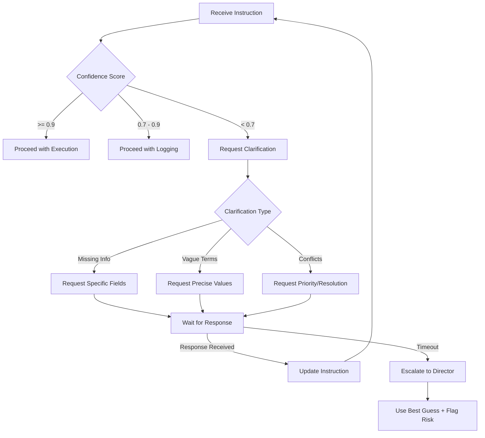

# Clarification Protocol

## Overview

This protocol addresses FM-2.2 (Fail to Ask for Clarification) by establishing clear guidelines for detecting ambiguity and requesting clarification in agent communications.

## Ambiguity Detection Framework

### 1. Ambiguity Indicators

```yaml
ambiguity_types:
  missing_information:
    - required_parameter_absent
    - incomplete_specification
    - undefined_reference
    
  vague_language:
    - imprecise_quantifiers: ["some", "many", "few", "several", "various"]
    - unclear_timeframes: ["soon", "later", "eventually", "ASAP"]
    - ambiguous_actions: ["handle", "process", "deal with", "take care of"]
    
  conflicting_instructions:
    - contradictory_requirements
    - mutually_exclusive_options
    - unclear_priorities
    
  multiple_interpretations:
    - overloaded_terms
    - context_dependent_meaning
    - unclear_scope
```

### 2. Confidence Scoring

```python
class AmbiguityDetector:
    def calculate_confidence_score(self, instruction: dict) -> float:
        """
        Returns confidence score 0.0 to 1.0
        Below 0.7 triggers clarification
        """
        score = 1.0
        
        # Check for missing required fields
        missing_fields = self.check_required_fields(instruction)
        score -= len(missing_fields) * 0.2
        
        # Check for vague language
        vague_terms = self.detect_vague_terms(instruction)
        score -= len(vague_terms) * 0.1
        
        # Check for conflicting instructions
        if self.has_conflicts(instruction):
            score -= 0.3
            
        return max(0.0, score)
```

## Clarification Request Format

### 1. Standard Clarification Template

```json
{
  "clarification_request": {
    "id": "uuid-v4",
    "from": "requesting_agent",
    "to": "originating_agent",
    "timestamp": "ISO-8601",
    "original_message_id": "uuid-of-ambiguous-message",
    "confidence_score": 0.65,
    "ambiguity_type": "missing_information",
    "specific_issues": [
      {
        "field": "target_date",
        "issue": "No specific date provided for 'soon'",
        "suggestion": "Please provide a specific date (YYYY-MM-DD)"
      }
    ],
    "proposed_interpretation": "Optional: what the agent thinks was meant",
    "timeout": 60
  }
}
```

### 2. Clarification Response Format

```json
{
  "clarification_response": {
    "request_id": "original-clarification-request-id",
    "from": "originating_agent",
    "to": "requesting_agent",
    "timestamp": "ISO-8601",
    "clarifications": [
      {
        "field": "target_date",
        "value": "2024-12-25",
        "explanation": "Christmas campaign deadline"
      }
    ],
    "updated_instruction": {
      // Complete instruction with clarifications applied
    }
  }
}
```

## Clarification Decision Tree



## Agent-Specific Clarification Guidelines

### Sales Agents
```yaml
always_clarify:
  - pricing_without_currency
  - discount_without_conditions
  - customer_segment_ambiguity
  - timeline_without_specifics

clarification_examples:
  - ambiguous: "Give them a good discount"
    clarify: "What percentage discount (e.g., 10%, 20%)? Any conditions?"
  
  - ambiguous: "Target high-value customers"
    clarify: "Define high-value: Revenue > $X? Order frequency? LTV?"
```

### Marketing Agents
```yaml
always_clarify:
  - campaign_without_budget
  - audience_without_demographics
  - content_without_format
  - goals_without_metrics

clarification_examples:
  - ambiguous: "Run a social media campaign"
    clarify: "Which platforms? Budget? Duration? Target audience?"
    
  - ambiguous: "Increase engagement"
    clarify: "Which metrics? Target increase %? Timeframe?"
```

### Operations Agents
```yaml
always_clarify:
  - quantity_without_units
  - location_without_specifics
  - priority_without_scale
  - deadline_without_timezone

clarification_examples:
  - ambiguous: "Ship orders quickly"
    clarify: "Define 'quickly': Same day? 24 hours? 48 hours?"
    
  - ambiguous: "Optimize inventory"
    clarify: "Optimize for: Cost? Availability? Turnover?"
```

## Clarification Timeout Handling

```python
class ClarificationHandler:
    def __init__(self, default_timeout=60):
        self.default_timeout = default_timeout
        self.escalation_chain = {
            "task_agent": "director_agent",
            "director_agent": "business_manager",
            "business_manager": "human_operator"
        }
    
    async def request_clarification(self, request, agent):
        try:
            response = await self.send_with_timeout(
                request, 
                agent, 
                timeout=request.get('timeout', self.default_timeout)
            )
            return response
            
        except TimeoutError:
            # Escalate to next level
            escalation_target = self.escalation_chain.get(agent.role)
            if escalation_target:
                return await self.escalate_clarification(
                    request, 
                    escalation_target
                )
            else:
                # Use best interpretation with risk flag
                return self.best_guess_with_risk(request)
```

## Clarification Metrics

### Key Performance Indicators

| Metric | Formula | Target | Alert Threshold |
|--------|---------|--------|-----------------|
| Clarification Rate | (Clarifications / Total Messages) × 100 | < 10% | > 20% |
| Clarification Resolution Time | Avg(Response Time) | < 60s | > 120s |
| Timeout Rate | (Timeouts / Clarifications) × 100 | < 5% | > 10% |
| Clarification Success Rate | (Resolved / Requested) × 100 | > 95% | < 90% |

### Tracking Schema

```sql
CREATE TABLE clarification_requests (
    request_id UUID PRIMARY KEY,
    from_agent VARCHAR(100) NOT NULL,
    to_agent VARCHAR(100) NOT NULL,
    original_message_id UUID,
    confidence_score FLOAT,
    ambiguity_type VARCHAR(50),
    specific_issues JSONB,
    requested_at TIMESTAMP NOT NULL,
    responded_at TIMESTAMP,
    response_status VARCHAR(20), -- 'resolved', 'timeout', 'escalated'
    escalated_to VARCHAR(100),
    resolution_time_ms INT,
    created_at TIMESTAMP DEFAULT CURRENT_TIMESTAMP,
    INDEX idx_agents (from_agent, to_agent),
    INDEX idx_status (response_status, requested_at)
);

CREATE TABLE clarification_patterns (
    pattern_id SERIAL PRIMARY KEY,
    agent_pair VARCHAR(200),
    ambiguity_type VARCHAR(50),
    occurrence_count INT DEFAULT 1,
    example_requests JSONB,
    suggested_improvement TEXT,
    last_seen TIMESTAMP DEFAULT CURRENT_TIMESTAMP,
    UNIQUE(agent_pair, ambiguity_type)
);
```

## Implementation Guidelines

### 1. Agent Prompt Enhancement

Add to all agent system prompts:

```markdown
## Clarification Protocol

When you receive instructions with confidence score < 0.7:
1. IDENTIFY specific ambiguities
2. REQUEST clarification with specific questions
3. WAIT for response (timeout: 60 seconds)
4. PROCEED only with clear instructions

Ambiguity indicators to watch for:
- Missing required information
- Vague quantifiers (some, many, few)
- Unclear timeframes (soon, later, ASAP)
- Conflicting requirements

Always prefer clarification over assumption.
```

### 2. Workflow Integration

```javascript
// n8n Clarification Node
const ambiguityScore = calculateAmbiguity($json.instruction);

if (ambiguityScore < 0.7) {
  const clarificationRequest = {
    id: $uuid(),
    from: "{{ $json.agent_id }}",
    to: $json.instruction.from,
    confidence_score: ambiguityScore,
    specific_issues: identifyIssues($json.instruction),
    timeout: 60
  };
  
  const response = await requestClarification(clarificationRequest);
  
  if (response.status === 'timeout') {
    // Escalate or use best guess
    await escalateToDirector(clarificationRequest);
  } else {
    // Continue with clarified instruction
    $json.instruction = response.updated_instruction;
  }
}
```

## Best Practices

### DO:
- Always check confidence before proceeding
- Ask specific, actionable questions
- Provide examples in clarification requests
- Track patterns for continuous improvement
- Escalate when timeouts occur

### DON'T:
- Make assumptions about critical values
- Ignore low confidence scores
- Ask vague clarification questions
- Wait indefinitely for responses
- Repeatedly ask the same clarifications

## Pattern Learning

```python
class ClarificationLearner:
    def learn_from_patterns(self):
        """
        Identify recurring clarification needs and suggest
        prompt improvements or system changes
        """
        patterns = self.analyze_clarification_history()
        
        for pattern in patterns:
            if pattern.occurrence_count > 10:
                suggestion = self.generate_improvement_suggestion(pattern)
                self.notify_system_admin(suggestion)
                
    def generate_improvement_suggestion(self, pattern):
        return {
            "issue": f"Frequent clarification needed for {pattern.ambiguity_type}",
            "between": pattern.agent_pair,
            "suggestion": "Update sender prompt to always include this information",
            "example_template": self.create_template_from_pattern(pattern)
        }
```

## Version History

- v1.0 (Current): Initial clarification protocol
- v1.1 (Planned): Add clarification templates library
- v2.0 (Future): ML-based ambiguity detection

---

*Last Updated: [Current Date]*  
*Status: Active*  
*Owner: Business Manager Agent*