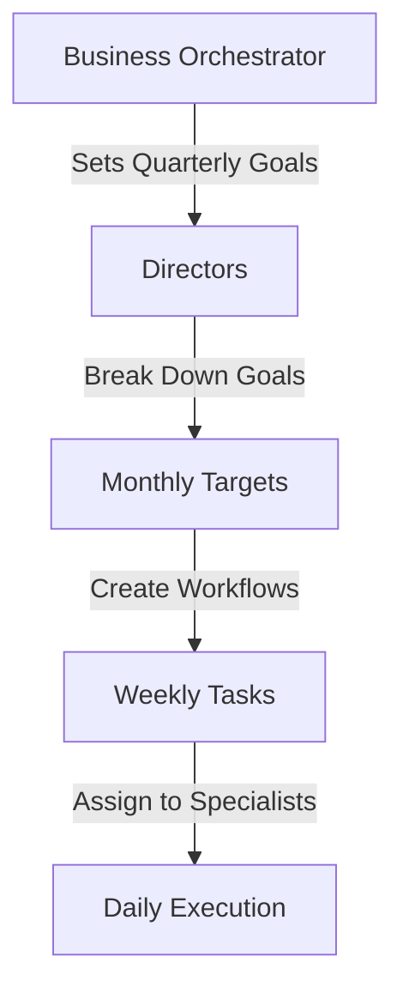

# Simplified Agent Orchestration Model

## Executive Summary

This document proposes a dramatically simplified agent architecture that reduces complexity from 57 agents to just 11 core agents, organized in a clear 3-tier hierarchy focused on goal achievement and workflow execution.

## Design Principles

1. **Goal-Driven**: Every agent action supports a measurable business goal
2. **Clear Hierarchy**: Simple 3-tier structure with defined responsibilities
3. **Workflow-Based**: All work happens through trackable workflows
4. **Single Responsibility**: Each agent has one clear purpose
5. **Measurable Outcomes**: Every action produces measurable results

## Simplified Agent Architecture

### Tier 1: Orchestrator (1 Agent)

```yaml
Business Orchestrator:
  purpose: Strategic planning and coordination
  responsibilities:
    - Set and track business goals
    - Assign goals to directors
    - Monitor overall performance
    - Handle escalations
    - Generate executive reports
  mcp_tools:
    - supabase (read all)
    - telegram (notifications)
    - report-generator
  reports_to: CEO/Stakeholders
```

### Tier 2: Directors (5 Agents)

```yaml
Revenue Director:
  purpose: Drive all revenue-generating activities
  owns_goals:
    - Monthly revenue targets
    - Customer acquisition
    - Average order value
  manages_workflows:
    - Sales pipelines
    - Marketing campaigns
    - Customer retention
  delegates_to:
    - Marketing Specialist
    - Sales Specialist
  mcp_tools:
    - shopify
    - stripe
    - marketing-analytics

Operations Director:
  purpose: Ensure smooth business operations
  owns_goals:
    - Order fulfillment SLA
    - Inventory optimization
    - Cost reduction
  manages_workflows:
    - Order processing
    - Inventory management
    - Supplier coordination
  delegates_to:
    - Fulfillment Specialist
  mcp_tools:
    - shopify
    - inventory-manager
    - logistics-tracker

Customer Director:
  purpose: Maximize customer satisfaction and lifetime value
  owns_goals:
    - Customer satisfaction score
    - Response time SLA
    - Retention rate
  manages_workflows:
    - Support tickets
    - Feedback collection
    - Loyalty programs
  delegates_to:
    - Support Specialist
  mcp_tools:
    - helpdesk
    - email
    - customer-analytics

Product Director:
  purpose: Optimize product portfolio performance
  owns_goals:
    - Product profitability
    - New product launches
    - Inventory turnover
  manages_workflows:
    - Product analysis
    - Pricing optimization
    - Collection curation
  delegates_to:
    - Analytics Specialist
  mcp_tools:
    - shopify
    - product-analytics
    - pricing-optimizer

Finance Director:
  purpose: Ensure financial health and compliance
  owns_goals:
    - Gross margin
    - Cash flow
    - Budget adherence
  manages_workflows:
    - Financial reporting
    - Budget tracking
    - Revenue attribution
  delegates_to:
    - Analytics Specialist
  mcp_tools:
    - accounting
    - financial-analytics
    - stripe
```

### Tier 3: Specialists (5 Agents)

```yaml
Marketing Specialist:
  purpose: Execute marketing campaigns across channels
  capabilities:
    - Email campaigns
    - Social media posts
    - Content creation
    - Ad management
  handles_tasks:
    - Create and send campaigns
    - Generate content
    - Analyze performance
  mcp_tools:
    - email-platform
    - social-media-apis
    - content-generator
    - ad-platforms

Sales Specialist:
  purpose: Convert leads and manage customer relationships
  capabilities:
    - Lead qualification
    - Quote generation
    - Follow-up sequences
    - Segment-specific messaging
  handles_personas:
    - Commercial buyers
    - Residential buyers
    - Online shoppers
  mcp_tools:
    - crm
    - email
    - shopify
    - quote-generator

Fulfillment Specialist:
  purpose: Ensure timely order delivery
  capabilities:
    - Order processing
    - Shipping coordination
    - Inventory updates
    - Return handling
  handles_tasks:
    - Process orders
    - Track shipments
    - Manage returns
  mcp_tools:
    - shopify
    - shipping-apis
    - inventory-manager

Support Specialist:
  purpose: Resolve customer issues
  capabilities:
    - Ticket management
    - Issue resolution
    - FAQ responses
    - Escalation handling
  handles_tasks:
    - Respond to inquiries
    - Process returns
    - Update documentation
  mcp_tools:
    - helpdesk
    - email
    - knowledge-base

Analytics Specialist:
  purpose: Provide data insights to all directors
  capabilities:
    - KPI calculation
    - Report generation
    - Trend analysis
    - Predictive modeling
  serves_all_directors: true
  mcp_tools:
    - supabase
    - analytics-platforms
    - report-generator
    - data-visualizer
```

## Workflow Execution Model

### 1. Goal Setting


### 2. Task Flow
```yaml
Example: New Order Workflow
  trigger: New Shopify order
  steps:
    1. Operations Director:
       - Receives order notification
       - Checks inventory availability
       - Assigns to Fulfillment Specialist
    
    2. Fulfillment Specialist:
       - Processes order
       - Generates shipping label
       - Updates tracking
       - Notifies customer
    
    3. Customer Director:
       - Monitors delivery
       - Sends follow-up email
       - Requests feedback
    
    4. Analytics Specialist:
       - Updates KPIs
       - Records attribution
       - Analyzes performance
```

### 3. Communication Patterns

```yaml
Delegation Pattern:
  Orchestrator -> Director: "Achieve Q1 revenue goal of $500K"
  Director -> Specialist: "Execute email campaign for Valentine's collection"
  Specialist -> MCP Tools: "Send campaign to segmented list"

Reporting Pattern:
  MCP Tools -> Specialist: "Campaign sent: 5,000 recipients"
  Specialist -> Director: "Campaign complete: 20% open rate"
  Director -> Orchestrator: "On track for monthly target"
```

## Key Benefits of Simplification

### 1. Reduced Complexity
- **Before**: 57 agents (1 + 9 + 47)
- **After**: 11 agents (1 + 5 + 5)
- **Reduction**: 81% fewer agents

### 2. Clear Accountability
- Each director owns specific business goals
- Specialists handle execution
- No overlapping responsibilities

### 3. Better Performance
- Fewer handoffs between agents
- Clearer communication paths
- Faster decision making

### 4. Easier Maintenance
- Simpler prompt engineering
- Fewer workflows to manage
- Clearer debugging paths

## Implementation Strategy

### Phase 1: Core Setup (Week 1)
1. Deploy new database schema
2. Create 11 agent definitions
3. Assign MCP tools
4. Define base workflows

### Phase 2: Goal Framework (Week 2)
1. Set up goal hierarchy
2. Create KPI definitions
3. Implement tracking
4. Test reporting

### Phase 3: Workflow Migration (Week 3-4)
1. Identify top 20 workflows
2. Redesign for new structure
3. Test with sample data
4. Deploy incrementally

### Phase 4: Full Migration (Week 5-6)
1. Migrate remaining workflows
2. Train on real data
3. Parallel run with old system
4. Cutover to new system

## Persona Handling

Instead of separate agents for each customer segment, the Sales Specialist uses dynamic personas:

```yaml
Sales Specialist Personas:
  commercial_buyer:
    context: "B2B sales, bulk orders, corporate requirements"
    tone: "Professional, ROI-focused"
    knowledge: "Procurement processes, net terms, volume discounts"
  
  residential_buyer:
    context: "Individual consumers, home decoration"
    tone: "Friendly, aesthetic-focused"
    knowledge: "Interior design, room matching, style guides"
  
  online_shopper:
    context: "Digital-first, price-sensitive"
    tone: "Casual, benefit-focused"
    knowledge: "Shipping, returns, online reviews"
```

## Monitoring & Optimization

### Key Metrics
1. **Goal Achievement Rate**: % of goals met on time
2. **Workflow Success Rate**: % of workflows completed without errors
3. **Response Time**: Average time to complete tasks
4. **Agent Utilization**: % of time agents are active
5. **Error Rate**: % of tasks requiring retry

### Optimization Process
1. Weekly performance reviews
2. Identify bottlenecks
3. Adjust workflows
4. Refine agent prompts
5. Update goal targets

## Conclusion

This simplified orchestration model provides:
- Clear goal-oriented structure
- Reduced operational complexity
- Better performance tracking
- Easier system maintenance
- Scalable architecture

The 81% reduction in agents, combined with clear workflow patterns, will significantly improve system reliability and performance while maintaining all necessary business capabilities.