# VividWalls Multi-Agent System - Complete Workflow Diagram

## Overview

This document provides a comprehensive visual representation of the VividWalls Multi-Agent System (MAS), showing all workflows handled by the core directors, orchestrator, specialized agents, and operational task sub-agents.

## Enhanced System Architecture Diagram

```mermaid
graph TB
    %% Styling
    classDef orchestrator fill:#2C3E50,stroke:#fff,stroke-width:4px,color:#fff
    classDef director fill:#E74C3C,stroke:#fff,stroke-width:3px,color:#fff
    classDef specialized fill:#3498DB,stroke:#fff,stroke-width:2px,color:#fff
    classDef operational fill:#27AE60,stroke:#fff,stroke-width:2px,color:#fff
    classDef platform fill:#F39C12,stroke:#fff,stroke-width:2px,color:#fff
    classDef task fill:#9B59B6,stroke:#fff,stroke-width:2px,color:#fff
    classDef mcp fill:#34495E,stroke:#fff,stroke-width:2px,color:#fff
    classDef compliance fill:#8E44AD,stroke:#fff,stroke-width:2px,color:#fff
    classDef risk fill:#C0392B,stroke:#fff,stroke-width:2px,color:#fff

    %% Business Manager (Orchestrator)
    BM[Business Manager Agent<br/>Central Orchestrator]:::orchestrator

    %% Core Directors (11)
    MD[Marketing Director]:::director
    SD[Sales Director]:::director
    OD[Operations Director]:::director
    CXD[Customer Experience Director]:::director
    PD[Product Director]:::director
    FD[Finance Director]:::director
    AD[Analytics Director]:::director
    TD[Technology Director]:::director
    SMD[Social Media Director]:::director
    CD[Creative Director]:::director
    CRD[Compliance & Risk Director]:::compliance
    VPD[Vendor & Partner Director]:::director

    %% Business Manager connections to Directors
    BM -->|Delegates| MD
    BM -->|Delegates| SD
    BM -->|Delegates| OD
    BM -->|Delegates| CXD
    BM -->|Delegates| PD
    BM -->|Delegates| FD
    BM -->|Delegates| AD
    BM -->|Delegates| TD
    BM -->|Delegates| CRD
    BM -->|Delegates| VPD
    
    %% Marketing Director reports
    MD -->|Manages| SMD
    MD -->|Manages| CD
    
    %% New Cross-Functional Connections
    CRD -->|Compliance Oversight| MD & SD & OD & PD & TD
    VPD -->|Vendor Management| OD & FD & TD
    CXD -->|Customer Insights| MD & PD & SD
    AD <-->|Data & Insights| MD & SD & CXD & PD

    %% Marketing Specialized Agents
    CS[Content Strategy Agent]:::specialized
    LGA[Lead Generation Agent]:::specialized
    EMA[Email Marketing Agent]:::specialized
    ABT[A/B Testing Agent]:::specialized
    CJA[Customer Journey Agent]:::specialized
    
    %% Compliance & Risk Agents
    DPA[Data Privacy Agent]:::compliance
    CMA[Crisis Management Agent]:::risk
    
    %% Vendor Management Agents
    VMA[Vendor Management Agent]:::operational
    
    %% Operational Workflows
    subgraph OW[Operational Workflows]
        BGT[Budget Tracking]:::operational
        VND[Vendor Onboarding]:::operational
        CMP[Compliance Monitoring]:::compliance
        CRM[CRM Integration]:::operational
    end
    
    %% Connections to Directors
    MD -->|Manages| LGA
    MD -->|Manages| EMA
    MD -->|Manages| ABT
    CXD -->|Manages| CJA
    CRD -->|Manages| DPA
    CRD -->|Manages| CMA
    VPD -->|Manages| VMA
    
    %% Cross-functional Connections
    LGA -->|Feeds| CRM
    EMA -->|Tracks| BGT
    ABT -->|Optimizes| EMA
    DPA -->|Monitors| CMP
    CMA -->|Alerts| CRD
    VMA -->|Manages| VND
    
    %% Feedback Loops
    CJA -->|Insights| MD
    CMP -->|Reports| CRD
    BGT -->|Updates| FD
    VND -->|Onboards| VPD
    CE[Creative Execution Agent]:::specialized
    CA[Campaign Analytics Agent]:::specialized
    MR[Marketing Research Agent]:::specialized
    CW[Copy Writer Agent]:::specialized
    CED[Copy Editor Agent]:::specialized
    KW[Keyword Agent]:::specialized
    EM[Email Marketing Agent]:::specialized
    NA[Newsletter Agent]:::specialized

    MD --> CS
    MD --> CE
    MD --> CA
    MD --> MR
    MD --> CW
    MD --> CED
    MD --> KW
    MD --> EM
    MD --> NA

    %% Social Media Platform Agents
    FB[Facebook Agent]:::platform
    IG[Instagram Agent]:::platform
    PI[Pinterest Agent]:::platform

    SMD --> FB
    SMD --> IG
    SMD --> PI

    %% Creative Specialized Agents
    DA[Design Agent]:::specialized
    CC[Content Creation Agent]:::specialized
    BA[Brand Consistency Agent]:::specialized

    CD --> DA
    CD --> CC
    CD --> BA

    %% Sales Specialized Agents (13 Personas)
    %% Commercial Segment
    HS[Hospitality Sales Agent]:::specialized
    CS_SALES[Corporate Sales Agent]:::specialized
    HCS[Healthcare Sales Agent]:::specialized
    RS[Retail Sales Agent]:::specialized
    RES[Real Estate Sales Agent]:::specialized

    %% Residential Segment
    HOS[Homeowner Sales Agent]:::specialized
    RNS[Renter Sales Agent]:::specialized
    IDS[Interior Designer Sales Agent]:::specialized
    ACS[Art Collector Sales Agent]:::specialized
    GBS[Gift Buyer Sales Agent]:::specialized

    %% Digital Segment
    MGS[Millennial/Gen Z Sales Agent]:::specialized
    GCS[Global Customer Sales Agent]:::specialized

    SD --> HS
    SD --> CS_SALES
    SD --> HCS
    SD --> RS
    SD --> RES
    SD --> HOS
    SD --> RNS
    SD --> IDS
    SD --> ACS
    SD --> GBS
    SD --> MGS
    SD --> GCS

    %% Operations Specialized Agents
    IM[Inventory Management Agent]:::specialized
    FA[Fulfillment Agent]:::specialized
    SA[Shopify Agent]:::specialized
    LA[Logistics Agent]:::specialized
    QC[Quality Control Agent]:::specialized
    SC[Supply Chain Agent]:::specialized

    OD --> IM
    OD --> FA
    OD --> SA
    OD --> LA
    OD --> QC
    OD --> SC

    %% Customer Experience Specialized Agents
    CSA[Customer Service Agent]:::specialized
    SM[Satisfaction Monitor Agent]:::specialized
    FR[Feedback Response Agent]:::specialized
    CLA[Customer Lifecycle Agent]:::specialized
    CRA[Customer Relationship Agent]:::specialized
    RG[Response Generation Agent]:::specialized

    CXD --> CSA
    CXD --> SM
    CXD --> FR
    CXD --> CLA
    CXD --> CRA
    CXD --> RG

    %% Product Specialized Agents
    PS[Product Strategy Agent]:::specialized
    MRA[Market Research Agent]:::specialized
    PC[Product Content Agent]:::specialized
    PP[Product Performance Agent]:::specialized

    PD --> PS
    PD --> MRA
    PD --> PC
    PD --> PP

    %% Finance Specialized Agents
    BMA[Budget Management Agent]:::specialized
    ROI[ROI Analysis Agent]:::specialized
    FC[Financial Calculation Agent]:::specialized

    FD --> BMA
    FD --> ROI
    FD --> FC

    %% Analytics Specialized Agents
    PA[Performance Analytics Agent]:::specialized
    DI[Data Insights Agent]:::specialized
    RE[Report Generation Agent]:::specialized
    PM[Predictive Modeling Agent]:::specialized

    AD --> PA
    AD --> DI
    AD --> RE
    AD --> PM

    %% Technology Specialized Agents
    SMA[System Monitoring Agent]:::specialized
    IMA[Integration Management Agent]:::specialized
    SI[System Integration Agent]:::specialized

    TD --> SMA
    TD --> IMA
    TD --> SI

    %% Task Agents (Operational)
    DE[Data Extraction Task Agent]:::task
    CA_TASK[Color Analysis Task Agent]:::task
    CC_TASK[Creative Content Task Agent]:::task
    ATI[Art Trend Intelligence Task Agent]:::task
    STAT[Statistical Analysis Task Agent]:::task
    BUDGET[Budget Intelligence Task Agent]:::task
    REV[Revenue Analytics Task Agent]:::task
    PERF[Performance Optimization Task Agent]:::task
    AUTO[Automation Development Task Agent]:::task

    %% Task Agent Assignments
    AD --> DE
    PD --> CA_TASK
    CD --> CC_TASK
    MD --> ATI
    AD --> STAT
    FD --> BUDGET
    FD --> REV
    TD --> PERF
    TD --> AUTO

    %% MCP Tool Access (Examples)
    SHOPIFY[Shopify MCP]:::mcp
    LINEAR[Linear MCP]:::mcp
    N8N[n8n MCP]:::mcp
    SUPABASE[Supabase MCP]:::mcp
    TELEGRAM[Telegram Integration]:::mcp
    EMAIL[SendGrid MCP]:::mcp
    STRIPE[Stripe MCP]:::mcp
    NEO4J[Neo4j MCP]:::mcp
    TWENTY[Twenty CRM MCP]:::mcp
    LISTMONK[Listmonk MCP]:::mcp

    %% MCP Connections (Simplified)
    BM -.->|Uses| LINEAR
    BM -.->|Uses| TELEGRAM
    BM -.->|Uses| EMAIL
    SD -.->|Uses| SHOPIFY
    SD -.->|Uses| TWENTY
    OD -.->|Uses| SHOPIFY
    TD -.->|Uses| N8N
    FD -.->|Uses| STRIPE
    EM -.->|Uses| LISTMONK
    
    %% Special Task Agents for Implementation
    TA1[Task Agent 1:<br/>MCP Integration Specialist]:::task
    TA2[Task Agent 2:<br/>Workflow Implementation]:::task
    TA3[Task Agent 3:<br/>Vector Store Integration]:::task
    TA4[Task Agent 4:<br/>Sales Consolidation]:::task
    TA5[Task Agent 5:<br/>Error Handling & Resilience]:::task

    BM ==>|Orchestrates| TA1
    BM ==>|Orchestrates| TA2
    BM ==>|Orchestrates| TA3
    BM ==>|Orchestrates| TA4
    BM ==>|Orchestrates| TA5

    %% Human Stakeholder
    HUMAN[Kingler Bercy<br/>Stakeholder]:::orchestrator
    HUMAN -.->|Reports to| BM
    BM -.->|Executive Reports| HUMAN
```

## Hierarchy Breakdown

### 1. Orchestrator Level

- **Business Manager Agent**: Central orchestrator coordinating all directors
- **Human Stakeholder**: Kingler Bercy (receives executive reports)

### 2. Director Level (9 Directors + Creative Director)

| Director | Responsibilities | Direct Reports |
|----------|-----------------|----------------|
| Marketing Director | Brand strategy, campaigns | Social Media Director, Creative Director, 9 specialized agents |
| Sales Director | Revenue generation, customer acquisition | 13 specialized sales persona agents |
| Operations Director | Supply chain, fulfillment | 6 specialized agents |
| Customer Experience Director | Customer satisfaction, support | 6 specialized agents |
| Product Director | Product strategy, market fit | 4 specialized agents |
| Finance Director | Budget management, financial planning | 3 specialized agents |
| Analytics Director | Data insights, performance tracking | 4 specialized agents |
| Technology Director | System architecture, integrations | 3 specialized agents |
| Social Media Director | Platform management | 3 platform agents |
| Creative Director | Visual identity, content creation | 3 specialized agents |

### 3. Specialized Agents (~48 total)

#### Marketing Department (9 agents)

- Content Strategy Agent
- Creative Execution Agent
- Campaign Analytics Agent
- Marketing Research Agent
- Copy Writer Agent
- Copy Editor Agent
- Keyword Agent
- Email Marketing Agent
- Newsletter Agent

#### Sales Department (13 persona agents)

**Commercial Segment (5)**

- Hospitality Sales Agent
- Corporate Sales Agent
- Healthcare Sales Agent
- Retail Sales Agent
- Real Estate Sales Agent

**Residential Segment (5)**

- Homeowner Sales Agent
- Renter Sales Agent
- Interior Designer Sales Agent
- Art Collector Sales Agent
- Gift Buyer Sales Agent

**Digital Segment (2)**

- Millennial/Gen Z Sales Agent
- Global Customer Sales Agent

#### Operations Department (6 agents)

- Inventory Management Agent
- Fulfillment Agent
- Shopify Agent
- Logistics Agent
- Quality Control Agent
- Supply Chain Agent

#### Customer Experience Department (6 agents)

- Customer Service Agent
- Satisfaction Monitor Agent
- Feedback Response Agent
- Customer Lifecycle Agent
- Customer Relationship Agent
- Response Generation Agent

#### Product Department (4 agents)

- Product Strategy Agent
- Market Research Agent
- Product Content Agent
- Product Performance Agent

#### Finance Department (3 agents)

- Budget Management Agent
- ROI Analysis Agent
- Financial Calculation Agent

#### Analytics Department (4 agents)

- Performance Analytics Agent
- Data Insights Agent
- Report Generation Agent
- Predictive Modeling Agent

#### Technology Department (3 agents)

- System Monitoring Agent
- Integration Management Agent
- System Integration Agent

#### Creative Department (3 agents)

- Design Agent
- Content Creation Agent
- Brand Consistency Agent

### 4. Platform Agents

- Facebook Agent
- Instagram Agent
- Pinterest Agent

### 5. Task Agents (Operational)

- Data Extraction Task Agent
- Color Analysis Task Agent
- Creative Content Task Agent
- Art Trend Intelligence Task Agent
- Statistical Analysis Task Agent
- Budget Intelligence Task Agent
- Revenue Analytics Task Agent
- Performance Optimization Task Agent
- Automation Development Task Agent

### 6. Special Implementation Task Agents

1. **Task Agent 1: MCP Integration Specialist**
   - Fixes disconnected MCP tools
   - Adds Telegram integration

2. **Task Agent 2: Workflow Implementation**
   - Creates missing agent workflows
   - Ensures proper connections

3. **Task Agent 3: Vector Store Integration**
   - Implements Supabase pgvector
   - Adds knowledge retrieval

4. **Task Agent 4: Sales Consolidation**
   - Consolidates sales agents
   - Implements 13 personas

5. **Task Agent 5: Error Handling & Resilience**
   - Adds error handling
   - Implements resilience patterns

## MCP (Model Context Protocol) Integrations

| MCP Server | Primary Users | Purpose |
|------------|---------------|----------|
| Linear MCP | Business Manager, Directors | Project management |
| Shopify MCP | Sales, Operations | E-commerce platform |
| n8n MCP | Technology Director | Workflow automation |
| Supabase MCP | All agents | Database and vector store |
| Telegram | Business Manager | Human-in-the-loop approval |
| SendGrid MCP | Business Manager, Marketing | Email communications |
| Stripe MCP | Finance Director | Payment processing |
| Neo4j MCP | All agents | Knowledge graph |
| Twenty CRM MCP | Sales Director | Customer relationship management |
| Listmonk MCP | Email Marketing Agent | Newsletter management |

## Communication Patterns

### Delegation Flow
1. Business Manager → Directors (strategic directives)
2. Directors → Specialized Agents (task assignments)
3. Specialized Agents → Platform/Task Agents (specific operations)

### Reporting Flow
1. Platform/Task Agents → Specialized Agents (operation results)
2. Specialized Agents → Directors (performance data)
3. Directors → Business Manager (consolidated insights)
4. Business Manager → Stakeholder (executive reports)

## Legend

- **Dark Blue (Orchestrator)**: Central coordination role
- **Red (Director)**: Department heads managing teams
- **Blue (Specialized)**: Domain-specific agents
- **Orange (Platform)**: External platform integrations
- **Purple (Task)**: Specific operational tasks
- **Dark Gray (MCP)**: External service integrations
- **Solid Arrows**: Direct management/delegation
- **Dashed Arrows**: Tool/service usage
- **Double Arrows**: Special orchestration

---

*Last Updated: June 2025*
*Version: 1.0*