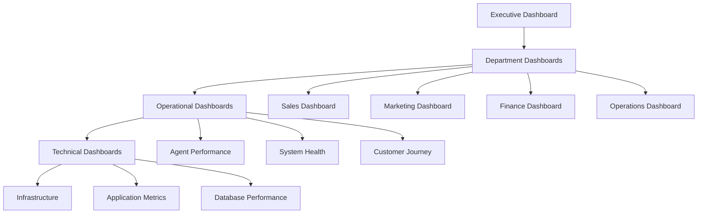

# VividWalls MAS Monitoring Dashboard Design

## Executive Summary

This document outlines the design for comprehensive monitoring dashboards that provide real-time visibility into the VividWalls Multi-Agent System performance, business metrics, and operational health.

## Dashboard Architecture

### Technology Stack
```yaml
infrastructure:
  metrics_collection:
    - Prometheus: Time-series metrics
    - OpenTelemetry: Distributed tracing
    - Elasticsearch: Log aggregation
    
  visualization:
    - Grafana: Primary dashboards
    - Kibana: Log analysis
    - Custom React: Business dashboards
    
  alerting:
    - Prometheus AlertManager
    - PagerDuty integration
    - Slack notifications
    
  storage:
    - TimescaleDB: Metrics retention
    - S3: Long-term archival
    - Redis: Real-time caching
```

## Dashboard Hierarchy



## Executive Dashboard

### Key Metrics Display
```yaml
executive_dashboard:
  layout: 4x3 grid
  refresh_rate: 1 minute
  
  widgets:
    revenue_tracker:
      position: [0, 0]
      size: [2, 1]
      metrics:
        - current_day_revenue
        - mtd_revenue
        - revenue_vs_target
        - growth_percentage
      visualization: line_chart_with_target
      
    order_volume:
      position: [2, 0]
      size: [1, 1]
      metrics:
        - orders_today
        - avg_order_value
        - conversion_rate
      visualization: stat_panels
      
    agent_performance:
      position: [3, 0]
      size: [1, 1]
      metrics:
        - active_agents
        - response_time_avg
        - success_rate
      visualization: gauge_charts
      
    department_health:
      position: [0, 1]
      size: [4, 1]
      metrics:
        - sales_efficiency
        - marketing_roi
        - operations_sla
        - customer_satisfaction
      visualization: department_scorecards
      
    alerts_summary:
      position: [0, 2]
      size: [2, 1]
      content:
        - critical_alerts
        - warnings
        - recent_incidents
      visualization: alert_timeline
      
    business_insights:
      position: [2, 2]
      size: [2, 1]
      content:
        - ai_generated_insights
        - trend_analysis
        - recommendations
      visualization: insight_cards
```

### Executive Dashboard Mockup
```
+------------------------+------------+------------+
|   Revenue Tracker      | Order Vol  | Agent Perf |
|   $45,231 ▲12%        | 142 Orders | 98% SLA    |
|   [====graph====]      | AOV: $318  | 1.2s Resp  |
+------------------------+------------+------------+
| Sales    Marketing    Operations    Customer Exp |
| ●95%     ●87%        ●92%          ●94%         |
| $32k     ROI 4.2x    99.2% SLA     4.8★         |
+------------------------+------------------------+
| Active Alerts (2)      | Business Insights       |
| ⚠ Inventory Low       | • Limited Edition #5    |
| ⚠ Response Time ↑     |   selling 3x faster     |
|                       | • VIP segment growing   |
+------------------------+------------------------+
```

## Department Dashboards

### Sales Dashboard
```yaml
sales_dashboard:
  sections:
    performance_overview:
      metrics:
        - daily_revenue_by_segment
        - sales_by_agent
        - pipeline_value
        - win_rate
      
    segment_analysis:
      displays:
        - individual_collectors_performance
        - interior_designers_metrics
        - commercial_buyers_tracking
        - vip_customer_activity
      
    agent_leaderboard:
      shows:
        - top_performers
        - revenue_generated
        - deals_closed
        - customer_satisfaction
        
    real_time_activity:
      tracks:
        - active_conversations
        - quotes_in_progress
        - recent_wins
        - at_risk_deals
```

### Marketing Dashboard
```yaml
marketing_dashboard:
  sections:
    campaign_performance:
      metrics:
        - active_campaigns
        - engagement_rates
        - conversion_metrics
        - roi_by_channel
        
    content_analytics:
      tracks:
        - blog_traffic
        - social_engagement
        - email_performance
        - seo_rankings
        
    customer_acquisition:
      displays:
        - acquisition_cost
        - channel_attribution
        - funnel_conversion
        - lifetime_value
        
    budget_utilization:
      shows:
        - spend_by_channel
        - remaining_budget
        - cost_per_acquisition
        - efficiency_trends
```

### Finance Dashboard
```yaml
finance_dashboard:
  sections:
    financial_overview:
      displays:
        - revenue_trends
        - expense_tracking
        - profit_margins
        - cash_flow
        
    budget_management:
      tracks:
        - department_budgets
        - variance_analysis
        - forecast_accuracy
        - approval_queue
        
    transaction_monitoring:
      shows:
        - recent_transactions
        - payment_processing
        - refund_tracking
        - reconciliation_status
        
    financial_health:
      metrics:
        - burn_rate
        - runway
        - unit_economics
        - growth_efficiency
```

## Operational Dashboards

### Agent Performance Dashboard
```yaml
agent_performance_dashboard:
  global_metrics:
    - total_active_agents
    - average_response_time
    - success_rate
    - escalation_rate
    
  agent_grid:
    layout: hierarchical_tree
    shows_per_agent:
      - status: [active, idle, error]
      - current_task
      - performance_score
      - recent_interactions
      
  performance_trends:
    - response_time_histogram
    - success_rate_over_time
    - workload_distribution
    - error_analysis
    
  detailed_view:
    expandable_per_agent:
      - conversation_history
      - decision_log
      - resource_usage
      - quality_metrics
```

### System Health Dashboard
```yaml
system_health_dashboard:
  infrastructure_health:
    servers:
      - cpu_usage
      - memory_usage
      - disk_space
      - network_throughput
      
    services:
      - n8n_workflows: [active, queued, failed]
      - database_connections
      - api_availability
      - mcp_server_status
      
  application_metrics:
    - request_rate
    - error_rate
    - latency_percentiles
    - queue_depth
    
  database_performance:
    - query_performance
    - connection_pool
    - replication_lag
    - index_efficiency
    
  external_dependencies:
    - shopify_api_health
    - email_service_status
    - payment_gateway_uptime
    - shipping_api_availability
```

### Customer Journey Dashboard
```yaml
customer_journey_dashboard:
  funnel_visualization:
    stages:
      - awareness: [impressions, clicks]
      - consideration: [page_views, time_on_site]
      - purchase: [cart_adds, checkouts]
      - retention: [repeat_rate, ltv]
      
  segment_journeys:
    comparison_view:
      - individual_collectors_path
      - interior_designers_path
      - commercial_buyers_path
      - vip_customers_path
      
  dropout_analysis:
    identifies:
      - high_dropout_points
      - reasons_for_abandonment
      - recovery_opportunities
      - optimization_suggestions
      
  real_time_tracking:
    shows:
      - active_visitors
      - current_stage_distribution
      - conversion_probability
      - intervention_opportunities
```

## Technical Dashboards

### Infrastructure Dashboard
```yaml
infrastructure_dashboard:
  compute_resources:
    - server_utilization
    - container_metrics
    - auto_scaling_events
    - cost_tracking
    
  network_performance:
    - bandwidth_usage
    - latency_maps
    - cdn_performance
    - ssl_certificate_status
    
  storage_metrics:
    - database_size
    - backup_status
    - s3_usage
    - cache_hit_rates
    
  security_monitoring:
    - failed_login_attempts
    - api_rate_limiting
    - firewall_blocks
    - vulnerability_scans
```

### Database Performance Dashboard
```yaml
database_performance_dashboard:
  query_analytics:
    - slow_query_log
    - most_frequent_queries
    - query_execution_plans
    - index_usage_stats
    
  resource_utilization:
    - cpu_usage
    - memory_allocation
    - io_operations
    - connection_count
    
  replication_health:
    - replication_lag
    - sync_status
    - conflict_resolution
    - backup_verification
    
  optimization_opportunities:
    - missing_indexes
    - table_statistics
    - vacuum_status
    - configuration_tuning
```

## Alert Configuration

### Alert Hierarchy
```yaml
alert_levels:
  critical:
    description: Immediate action required
    examples:
      - revenue_processing_failure
      - database_down
      - agent_orchestrator_failure
    notification:
      - pagerduty: immediate
      - slack: #critical-alerts
      - email: executives
      - sms: on-call
      
  high:
    description: Significant issue requiring attention
    examples:
      - response_time_degradation
      - high_error_rate
      - budget_exceeded
    notification:
      - slack: #alerts
      - email: team_leads
      - dashboard: prominent_display
      
  medium:
    description: Issue requiring investigation
    examples:
      - conversion_rate_drop
      - agent_performance_decline
      - inventory_low
    notification:
      - slack: #monitoring
      - email: relevant_team
      - dashboard: warning_indicator
      
  low:
    description: Informational or minor issue
    examples:
      - scheduled_maintenance
      - non_critical_updates
      - performance_optimization
    notification:
      - dashboard: info_panel
      - weekly_summary: included
```

### Alert Rules
```yaml
alert_rules:
  revenue_alerts:
    - name: revenue_processing_stopped
      condition: revenue_transactions == 0 for 10m
      severity: critical
      
    - name: revenue_below_threshold
      condition: hourly_revenue < (avg_hourly_revenue * 0.5)
      severity: high
      
  agent_alerts:
    - name: agent_response_degradation
      condition: p95_response_time > 3s for 5m
      severity: high
      
    - name: agent_failure_rate
      condition: error_rate > 5% for 5m
      severity: critical
      
  system_alerts:
    - name: database_connection_exhaustion
      condition: available_connections < 10
      severity: critical
      
    - name: disk_space_warning
      condition: disk_usage > 80%
      severity: medium
```

## Mobile Dashboard Design

### Mobile Executive View
```yaml
mobile_dashboard:
  layout: single_column_scroll
  
  summary_card:
    displays:
      - today_revenue
      - active_orders
      - system_status
    
  quick_metrics:
    swipeable_cards:
      - sales_performance
      - agent_status
      - recent_alerts
      
  detailed_views:
    tap_to_expand:
      - department_details
      - alert_management
      - quick_actions
```

### Mobile App Mockup
```
┌─────────────────────┐
│ VividWalls MAS      │
│ ═══════════════════ │
│ Today: $45,231 ▲12% │
│ Orders: 142  AOV:$318│
│ ┌─────────────────┐ │
│ │   Revenue Graph  │ │
│ │   [====chart===] │ │
│ └─────────────────┘ │
│                     │
│ Departments    ▼    │
│ ┌─────────────────┐ │
│ │Sales      ●95%  │ │
│ │Marketing  ●87%  │ │
│ │Operations ●92%  │ │
│ └─────────────────┘ │
│                     │
│ Recent Alerts  (2)  │
│ ⚠ Inventory Low     │
│ ⚠ Response Time ↑   │
└─────────────────────┘
```

## Data Retention & Archival

### Retention Policies
```yaml
data_retention:
  real_time_metrics:
    granularity: 1_second
    retention: 24_hours
    
  minute_aggregates:
    granularity: 1_minute
    retention: 7_days
    
  hourly_aggregates:
    granularity: 1_hour
    retention: 90_days
    
  daily_aggregates:
    granularity: 1_day
    retention: 2_years
    
  monthly_summaries:
    granularity: 1_month
    retention: indefinite
```

## Implementation Roadmap

### Phase 1: Core Dashboards (Week 1-2)
- Executive Dashboard
- System Health Dashboard
- Basic Alerting

### Phase 2: Department Dashboards (Week 3-4)
- Sales Dashboard
- Marketing Dashboard
- Finance Dashboard
- Operations Dashboard

### Phase 3: Advanced Features (Week 5-6)
- Agent Performance Analytics
- Customer Journey Tracking
- Predictive Insights
- Mobile Application

### Phase 4: Optimization (Week 7-8)
- Performance Tuning
- Custom Visualizations
- Advanced Alerting
- Integration Completion

## Success Metrics

### Dashboard Effectiveness
- Page load time: <2s
- Data freshness: <1 minute
- User adoption: >90%
- Alert accuracy: >95%
- Actionable insights: Daily

### Business Impact
- Decision speed: +50%
- Issue detection: <5 minutes
- Revenue optimization: +10%
- Operational efficiency: +25%

## Conclusion

This comprehensive monitoring dashboard design provides complete visibility into the VividWalls MAS ecosystem. From executive-level business metrics to detailed technical performance data, these dashboards enable proactive management and rapid issue resolution.

**Key Features:**
1. Real-time business visibility
2. Hierarchical drill-down capability
3. Predictive analytics integration
4. Mobile accessibility
5. Intelligent alerting

---

Document Version: 1.0
Created: 2025-01-29
Status: Ready for Development
Estimated Implementation: 8 weeks