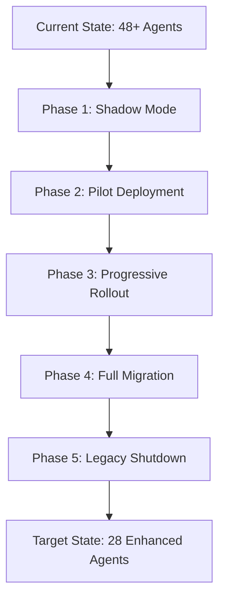
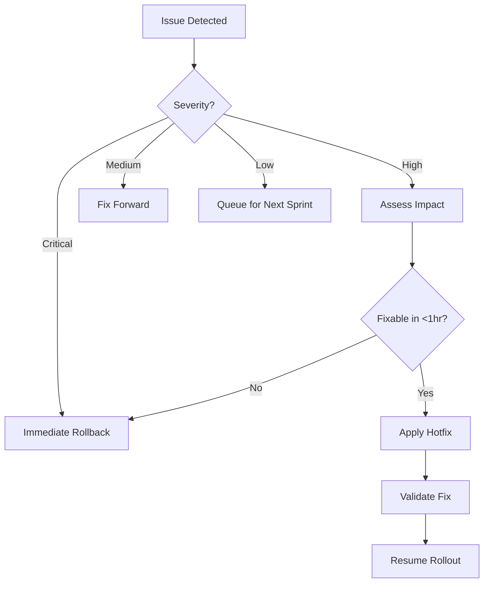

# VividWalls MAS Phased Rollout Strategy

## Executive Summary

This document outlines a risk-minimized, phased approach to rolling out the VividWalls MAS improvements. The strategy emphasizes parallel running, incremental deployment, and continuous validation to ensure business continuity.

## Rollout Philosophy

### Core Principles:
1. **Zero Downtime** - Business operations continue uninterrupted
2. **Gradual Transition** - Changes introduced incrementally
3. **Parallel Running** - Old and new systems operate simultaneously
4. **Continuous Validation** - Each change verified before proceeding
5. **Instant Rollback** - Ability to revert within minutes

## Rollout Phases Overview



## Phase 1: Shadow Mode (Weeks 1-3)

### Objective
Deploy enhanced agents alongside existing ones without affecting production traffic.

### Week 1: Infrastructure Setup
```yaml
deployment_mode: shadow
traffic_split: 
  existing_agents: 100%
  enhanced_agents: 0% (shadow only)

activities:
  - Deploy enhanced director agents
  - Mirror production traffic to new agents
  - Collect performance metrics
  - Compare outputs between systems
```

### Week 2: Validation & Tuning
- Compare shadow outputs with production
- Identify discrepancies
- Tune enhanced agent responses
- Validate persona switching

### Week 3: Confidence Building
- Run critical business scenarios
- Verify financial calculations
- Test edge cases
- Document behavior differences

### Success Criteria:
- 95% output match between systems
- No critical discrepancies
- Performance metrics within targets
- All personas functioning correctly

## Phase 2: Pilot Deployment (Weeks 4-5)

### Objective
Route limited production traffic through enhanced agents.

### Pilot Selection Criteria:
```yaml
pilot_segments:
  - internal_testing: 100% (all internal traffic)
  - vip_customers: 5% (volunteer beta testers)
  - new_visitors: 10% (lower risk)
  
excluded_from_pilot:
  - commercial_buyers (high value)
  - active_orders (transaction risk)
  - support_escalations (critical)
```

### Week 4: Limited Production Traffic
```yaml
traffic_routing:
  monday:
    enhanced_agents: 5%
    existing_agents: 95%
  
  tuesday-wednesday:
    enhanced_agents: 10%
    existing_agents: 90%
  
  thursday-friday:
    enhanced_agents: 15%
    existing_agents: 85%
```

### Week 5: Expanded Pilot
- Increase traffic percentage daily
- Monitor all metrics closely
- Gather user feedback
- Address any issues immediately

### Rollback Triggers:
- Error rate >2%
- Response time >3s
- Revenue impact >1%
- Critical bug discovered

## Phase 3: Progressive Rollout (Weeks 6-8)

### Objective
Systematically migrate production traffic by department and function.

### Week 6: Sales Department Migration
```yaml
migration_schedule:
  monday:
    - individual_collectors: 25%
    - interior_designers: 10%
  
  wednesday:
    - individual_collectors: 50%
    - interior_designers: 25%
    - healthcare_segment: 10%
  
  friday:
    - all_sales_segments: 50%
```

### Week 7: Marketing & Analytics Migration
```yaml
department_migration:
  marketing:
    - email_campaigns: enhanced_agents
    - social_media: enhanced_agents
    - content_generation: parallel_mode
  
  analytics:
    - reporting: enhanced_agents
    - real_time: parallel_validation
    - predictive: shadow_mode
```

### Week 8: Operations & Support Migration
- Customer service routing
- Order processing
- Inventory management
- Financial operations

### Validation Checkpoints:
- Daily performance reviews
- Hourly error monitoring
- Real-time revenue tracking
- Customer satisfaction scores

## Phase 4: Full Migration (Weeks 9-10)

### Objective
Complete transition to enhanced agent system.

### Week 9: Final Migration Push
```yaml
traffic_distribution:
  monday: 75% enhanced
  tuesday: 85% enhanced
  wednesday: 95% enhanced
  thursday: 99% enhanced
  friday: 100% enhanced (standby legacy)
```

### Week 10: Stabilization
- 100% on enhanced agents
- Legacy system in standby
- Performance optimization
- Issue resolution

### Contingency Plans:
1. **Instant Rollback** - Single command reverts to legacy
2. **Partial Rollback** - Revert specific departments
3. **Hybrid Mode** - Run both systems for problem areas

## Phase 5: Legacy Shutdown (Weeks 11-12)

### Objective
Safely decommission legacy agents and clean up resources.

### Week 11: Legacy Wind-down
- Archive legacy agent data
- Document final configurations
- Extract lessons learned
- Prepare shutdown procedures

### Week 12: Resource Cleanup
```bash
# Cleanup checklist
- [ ] Stop legacy n8n workflows
- [ ] Archive workflow configurations
- [ ] Remove legacy database tables
- [ ] Clean up unused MCP servers
- [ ] Update documentation
- [ ] Release compute resources
```

## Department-Specific Rollout Plans

### Sales Department
```yaml
rollout_order:
  1. individual_collectors:
     risk: low
     impact: medium
     rollback_time: 5_minutes
  
  2. interior_designers:
     risk: medium
     impact: high
     rollback_time: 10_minutes
  
  3. commercial_buyers:
     risk: high
     impact: very_high
     rollback_time: immediate
```

### Marketing Department
```yaml
rollout_strategy:
  email_marketing:
    - Test with internal lists
    - Migrate newsletter subscribers
    - Move to transactional emails
    - Enable for campaigns
  
  social_media:
    - Start with scheduling
    - Add engagement monitoring
    - Enable auto-responses
    - Activate full automation
```

### Financial Operations
```yaml
critical_validations:
  - Transaction accuracy: 100%
  - Revenue attribution: Match to penny
  - Budget tracking: Real-time accuracy
  - Compliance: Full audit trail
  
rollout_requirements:
  - CFO approval required
  - Parallel running mandatory
  - Daily reconciliation
  - External audit validation
```

## Monitoring & Metrics

### Real-Time Dashboards
```yaml
critical_metrics:
  system_health:
    - Agent response times
    - Error rates by department
    - Traffic distribution
    - Resource utilization
  
  business_impact:
    - Revenue per hour
    - Order completion rate
    - Customer satisfaction
    - Agent productivity
  
  comparison_metrics:
    - Legacy vs Enhanced performance
    - Cost per transaction
    - Time to resolution
    - Accuracy scores
```

### Alert Thresholds
```yaml
alerts:
  critical:
    error_rate: ">5%"
    response_time: ">5s"
    revenue_drop: ">2%"
    action: immediate_rollback
  
  warning:
    error_rate: ">2%"
    response_time: ">3s" 
    revenue_drop: ">1%"
    action: investigate_and_assess
  
  info:
    error_rate: ">1%"
    response_time: ">2s"
    action: monitor_closely
```

## Communication Plan

### Stakeholder Communications
```yaml
internal_communications:
  executives:
    frequency: daily_during_rollout
    format: dashboard_and_summary
    escalation: immediate_for_issues
  
  department_heads:
    frequency: twice_daily
    format: detailed_metrics
    focus: department_specific
  
  operations_team:
    frequency: real_time
    format: slack_channel
    tools: monitoring_dashboards

external_communications:
  vip_customers:
    timing: 1_week_before_pilot
    message: exclusive_beta_access
    support: dedicated_channel
  
  general_customers:
    timing: post_stabilization
    message: improved_experience
    support: standard_channels
```

### Issue Resolution Process


## Risk Mitigation Strategies

### Technical Risks
```yaml
risk_mitigations:
  data_corruption:
    prevention: 
      - Read-only shadow mode
      - Validation before writes
      - Audit trail everything
    response:
      - Immediate rollback
      - Restore from backup
      - Reconciliation process
  
  performance_degradation:
    prevention:
      - Load testing in advance
      - Gradual traffic increase
      - Resource auto-scaling
    response:
      - Traffic throttling
      - Cache warming
      - Horizontal scaling
  
  integration_failures:
    prevention:
      - Contract testing
      - Mock service fallbacks
      - Circuit breakers
    response:
      - Fallback to legacy
      - Graceful degradation
      - Manual override options
```

### Business Risks
```yaml
business_continuity:
  revenue_protection:
    - Never risk checkout flow
    - Maintain payment processing
    - Protect order fulfillment
  
  customer_experience:
    - Seamless transition
    - No visible disruption
    - Improved response times
  
  brand_reputation:
    - Proactive communication
    - Enhanced capabilities focus
    - Success story preparation
```

## Success Criteria

### Phase Gates
Each phase must meet criteria before proceeding:

```yaml
phase_1_complete:
  - Shadow accuracy: >95%
  - Performance parity: Achieved
  - Persona validation: Passed
  - Team confidence: High

phase_2_complete:
  - Pilot error rate: <1%
  - User feedback: Positive
  - Revenue impact: Neutral/Positive
  - Rollback tested: Successful

phase_3_complete:
  - Department migrations: Successful
  - Integration points: Validated
  - Performance gains: Demonstrated
  - Risk controls: Effective

phase_4_complete:
  - Full traffic migrated: 100%
  - Stability achieved: 48 hours
  - Metrics improved: Confirmed
  - Legacy standby: Ready

phase_5_complete:
  - Legacy decommissioned: Complete
  - Resources reclaimed: 100%
  - Documentation updated: Current
  - Lessons learned: Captured
```

## Rollback Procedures

### Instant Rollback (Emergency)
```bash
# One-command rollback
./rollback-to-legacy.sh --immediate --preserve-data

# Validates and switches traffic in <30 seconds
# Preserves all transaction data
# Notifies all stakeholders
```

### Planned Rollback
```yaml
rollback_steps:
  1. assess_issue:
     - Identify root cause
     - Determine fix timeline
     - Evaluate business impact
  
  2. communicate_decision:
     - Notify stakeholders
     - Update status page
     - Brief support team
  
  3. execute_rollback:
     - Switch traffic routing
     - Verify legacy operation
     - Monitor closely
  
  4. plan_retry:
     - Fix identified issues
     - Enhance testing
     - Schedule next attempt
```

## Post-Rollout Activities

### Week 13-14: Optimization
- Performance tuning
- Cost optimization
- Process refinement
- Enhancement planning

### Week 15-16: Knowledge Transfer
- Team training sessions
- Documentation updates
- Runbook creation
- Best practices guide

### Ongoing: Continuous Improvement
- Monthly reviews
- Quarterly enhancements
- Annual architecture review
- Innovation pipeline

## Conclusion

This phased rollout strategy ensures a safe, controlled transition to the enhanced VividWalls MAS. By emphasizing parallel running, continuous validation, and instant rollback capabilities, we minimize risk while maximizing the chances of successful deployment.

**Key Success Factors:**
1. Patient, gradual approach
2. Comprehensive monitoring
3. Clear communication
4. Instant rollback capability
5. Continuous validation

---

Document Version: 1.0
Created: 2025-01-29
Status: Ready for Review
Rollout Start: Pending Approval