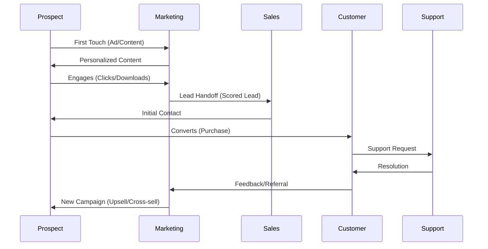
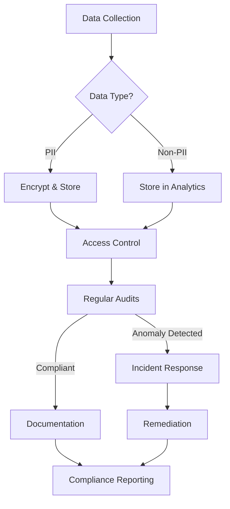
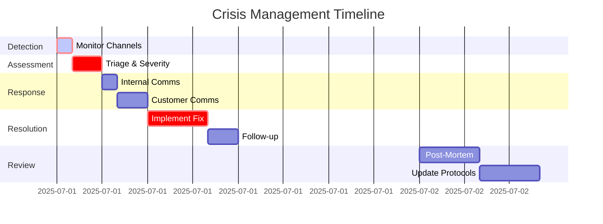
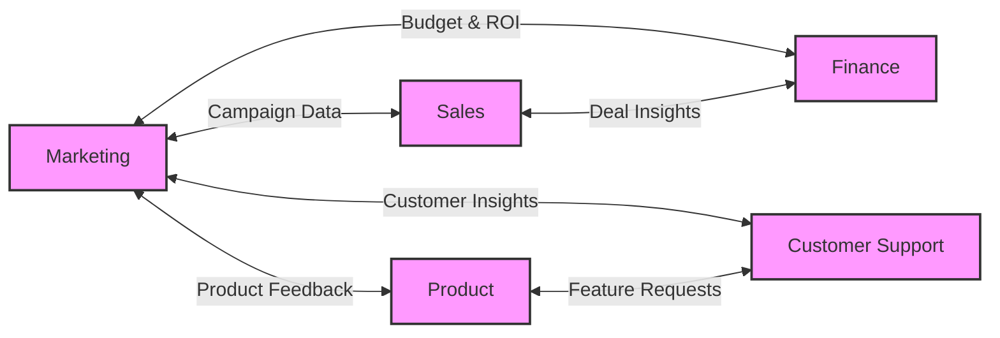
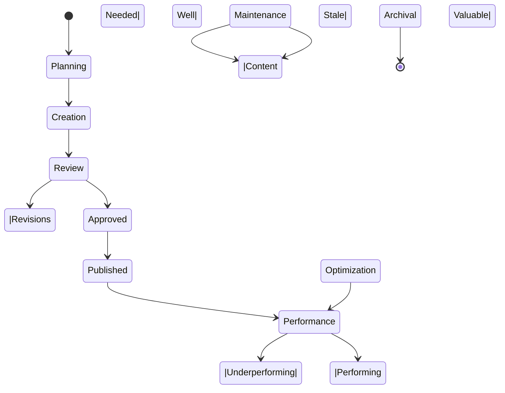
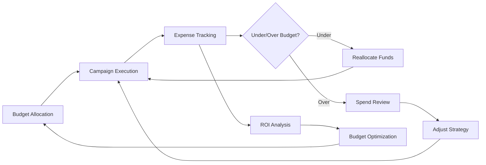
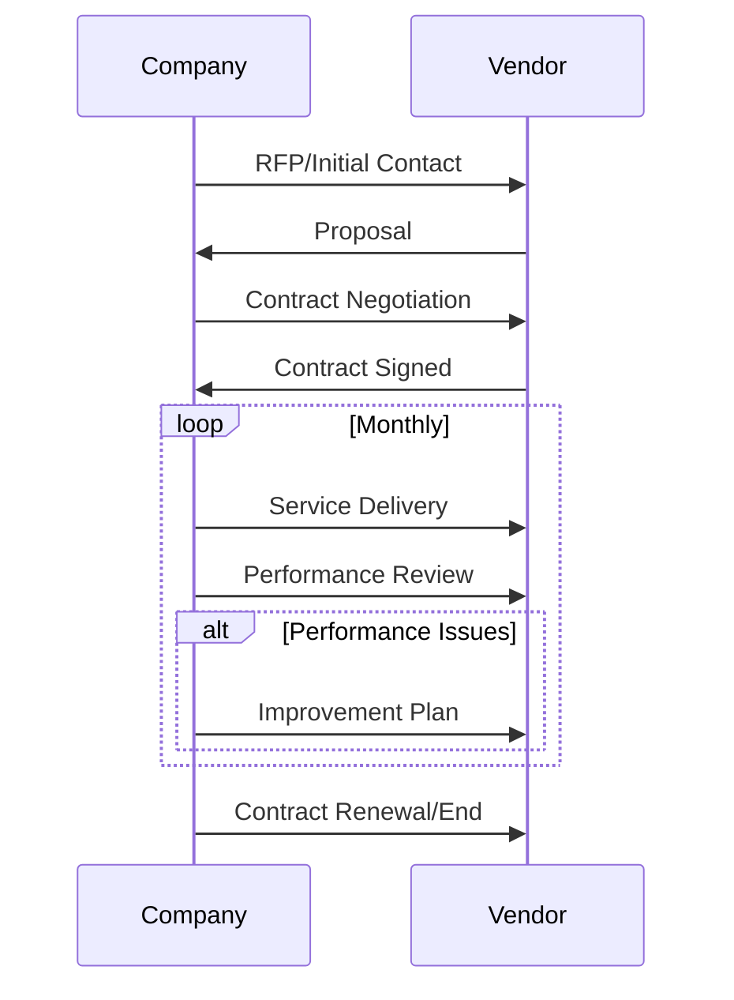
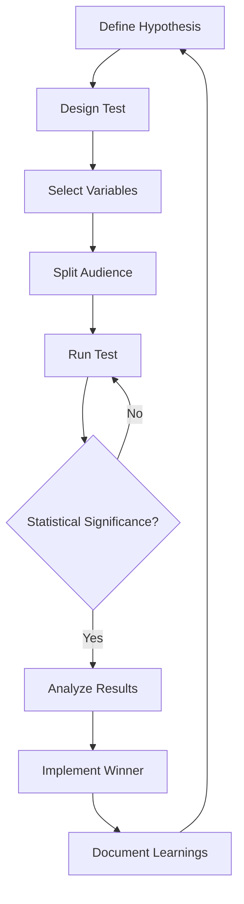

# Additional Critical Workflows for VividWalls MAS

## 1. Customer Journey Orchestration

## 2. Compliance & Data Privacy Workflow

## 3. Crisis Management Protocol

## 4. Cross-Functional Collaboration Framework

## 5. Content Lifecycle Management

## 6. Budget Management System

## 7. Vendor Management Workflow

## 8. A/B Testing Framework

## Integration with Main MAS

These workflows should be integrated into the main VIVID_MAS_COMPLETE_WORKFLOW_DIAGRAM.md as follows:

1. **Customer Journey Orchestration**: Connect to Marketing and Sales Directors
2. **Compliance & Data Privacy**: Connect to Technology and Operations Directors
3. **Crisis Management**: Connect to all Directors with clear escalation paths
4. **Cross-Functional Collaboration**: Overlay on existing director connections
5. **Content Lifecycle**: Connect to Marketing and Creative Directors
6. **Budget Management**: Connect to Finance Director and all department heads
7. **Vendor Management**: Connect to Operations and Finance Directors
8. **A/B Testing**: Connect to Marketing and Analytics Directors

## Implementation Priority

1. Immediate (Week 1-2):
   - Compliance & Data Privacy
   - Crisis Management
   - Customer Journey Orchestration

2. Short-term (Week 3-4):
   - Cross-Functional Collaboration
   - Budget Management
   - A/B Testing Framework

3. Medium-term (Month 2):
   - Content Lifecycle Management
   - Vendor Management

## Monitoring & Optimization

Each workflow should have:
- Clear KPIs and metrics
- Regular review cycles
- Continuous improvement processes
- Documentation and training materials
