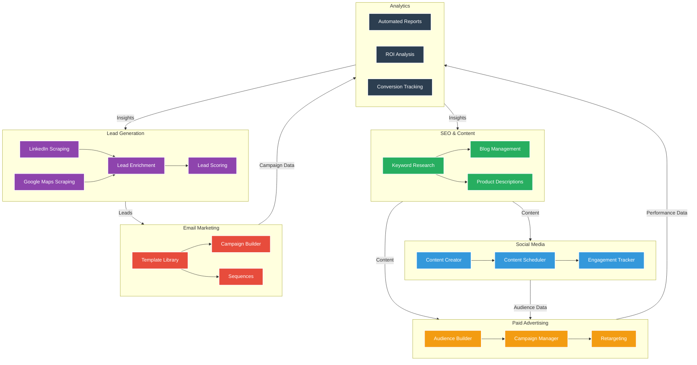
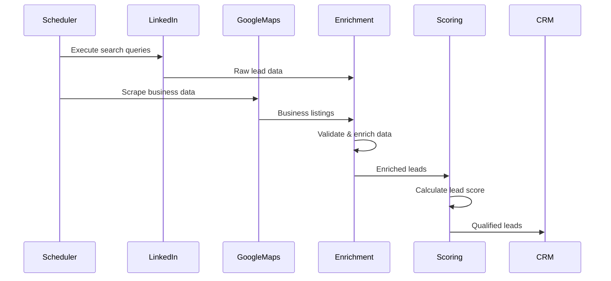
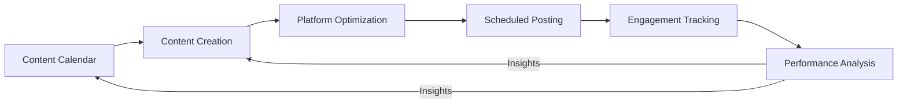
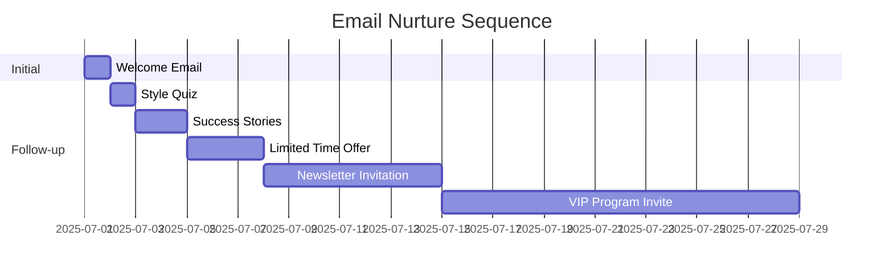
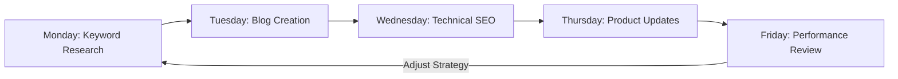

# VividWalls Marketing Workflow System

## Overview

This document outlines the comprehensive marketing workflow system for VividWalls, designed to achieve the core marketing objectives through integrated, automated processes.

## Core Marketing Objectives

1. Generate $30K+ revenue from $2K investment in 3 months
2. Build 3,000+ email subscriber base through cold outreach
3. Achieve 1% lookalike audience with 100+ pixel conversions
4. Establish domain authority through AI SEO content
5. Maintain daily social media presence across 3 platforms
6. Optimize for 3.5%+ conversion rate on art sales

## Complete Marketing Workflow

## Key Workflow Components

### 1. Lead Generation Workflow

### 2. Social Media Workflow

### 3. Email Marketing Sequence

### 4. SEO & Content Pipeline

## Implementation Timeline

### Month 1: Foundation
- Set up lead generation automation
- Configure social media scheduling
- Implement email nurture sequence
- Launch initial SEO content

### Month 2: Optimization
- Refine targeting based on initial data
- Scale successful campaigns
- Expand content topics
- Implement A/B testing

### Month 3: Scaling
- Expand to new channels
- Optimize conversion paths
- Scale budget on winning strategies
- Implement advanced segmentation

## Performance Metrics

| KPI | Target | Frequency |
|-----|--------|-----------|
| Email List Growth | +1,000/month | Weekly |
| Lead Conversion | 3.5%+ | Weekly |
| Social Engagement | 5%+ | Daily |
| SEO Traffic | +20% MoM | Monthly |
| ROAS | 5x+ | Weekly |

## Integration Points

- **CRM**: HubSpot/Salesforce
- **Email**: Mailchimp/Klaviyo
- **Social**: Buffer/Hootsuite
- **Analytics**: Google Analytics 4
- **Automation**: n8n/Zapier

## Next Steps

1. Implement the lead generation workflow
2. Set up social media automation
3. Configure email nurture sequences
4. Launch initial SEO content
5. Set up analytics and reporting
