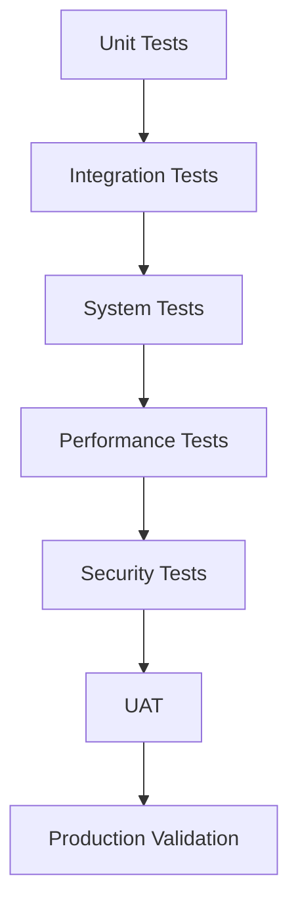

# VividWalls MAS Testing Procedures

## Executive Summary

This document defines comprehensive testing procedures for the VividWalls MAS implementation. It covers unit testing, integration testing, system testing, performance testing, and user acceptance testing to ensure quality and reliability.

## Testing Strategy Overview

### Testing Principles
1. **Test Early, Test Often** - Continuous testing throughout development
2. **Automate Everything** - Maximize test automation coverage
3. **Risk-Based Testing** - Focus on critical business functions
4. **Data-Driven Testing** - Use production-like data
5. **End-to-End Validation** - Test complete user journeys

### Testing Levels


## Test Environment Setup

### Environment Configuration
```yaml
environments:
  development:
    purpose: Developer testing
    data: Synthetic test data
    scale: Single instance
    refresh: On-demand
  
  integration:
    purpose: Integration testing
    data: Subset of production
    scale: Reduced capacity
    refresh: Daily
  
  staging:
    purpose: Pre-production validation
    data: Production mirror
    scale: Production-like
    refresh: Weekly
  
  production:
    purpose: Live system
    data: Real customer data
    scale: Full capacity
    monitoring: 24/7
```

### Test Data Management
```sql
-- Test data categories
CREATE SCHEMA test_data;

-- Customer test data
CREATE TABLE test_data.customers AS
SELECT * FROM customers 
WHERE email LIKE '%@test.vividwalls.co'
OR customer_type = 'test';

-- Order test data with various scenarios
CREATE TABLE test_data.orders AS
SELECT * FROM orders
WHERE customer_id IN (SELECT id FROM test_data.customers)
OR order_number LIKE 'TEST-%';

-- Financial test transactions
CREATE TABLE test_data.financial_transactions AS
SELECT * FROM financial_transactions
WHERE is_test = true;
```

## Unit Testing Procedures

### Agent Unit Tests
```javascript
// Example: Sales Director Agent Unit Tests
describe('SalesDirectorAgent', () => {
  describe('Persona Switching', () => {
    test('should switch to healthcare persona for medical keywords', async () => {
      const agent = new SalesDirectorAgent();
      const input = "Need art for our hospital waiting room";
      
      await agent.processRequest(input);
      
      expect(agent.activePersona).toBe('healthcare_sales_specialist');
      expect(agent.knowledgeBase).toBe('healthcare_sales_kb');
    });
    
    test('should maintain context during persona switch', async () => {
      const agent = new SalesDirectorAgent();
      agent.setContext({ customer_type: 'hospital' });
      
      await agent.switchPersona('corporate_sales_specialist');
      
      expect(agent.context.customer_type).toBe('hospital');
      expect(agent.context.previous_persona).toBe('healthcare_sales_specialist');
    });
  });
  
  describe('Revenue Attribution', () => {
    test('should correctly attribute sale to agent', async () => {
      const agent = new SalesDirectorAgent();
      const order = { id: 'TEST-001', amount: 599.99 };
      
      const attribution = await agent.attributeRevenue(order);
      
      expect(attribution.agent_id).toBe(agent.id);
      expect(attribution.amount).toBe(599.99);
      expect(attribution.commission).toBe(59.99); // 10% commission
    });
  });
});
```

### Financial System Unit Tests
```javascript
describe('FinancialTrackingSystem', () => {
  describe('Transaction Recording', () => {
    test('should record revenue transaction with proper attribution', async () => {
      const transaction = {
        type: 'revenue',
        amount: 799.99,
        order_id: 'TEST-001',
        agent_id: 'sales_director_001'
      };
      
      const result = await recordTransaction(transaction);
      
      expect(result.id).toBeDefined();
      expect(result.recorded_at).toBeDefined();
      expect(result.attribution_chain).toContain('sales_director_001');
    });
    
    test('should validate transaction amounts', async () => {
      const invalidTransaction = {
        type: 'revenue',
        amount: -100,
        order_id: 'TEST-002'
      };
      
      await expect(recordTransaction(invalidTransaction))
        .rejects.toThrow('Invalid transaction amount');
    });
  });
  
  describe('Budget Management', () => {
    test('should enforce budget limits', async () => {
      const budget = await getBudget('marketing', '2025-01');
      const expense = {
        amount: budget.remaining + 100,
        department: 'marketing'
      };
      
      await expect(recordExpense(expense))
        .rejects.toThrow('Budget exceeded');
    });
  });
});
```

## Integration Testing Procedures

### Agent Communication Tests
```yaml
test_scenarios:
  agent_handoff:
    description: Test handoff between directors
    steps:
      1. Marketing Director receives campaign request
      2. Identifies need for sales data
      3. Requests data from Sales Director
      4. Sales Director responds with segment data
      5. Marketing Director completes campaign
    validations:
      - Message acknowledgment received
      - Correct data transferred
      - Context maintained
      - Response time < 2s
  
  escalation_flow:
    description: Test escalation to Business Manager
    steps:
      1. Customer Service agent receives complex issue
      2. Attempts resolution with knowledge base
      3. Escalates to department director
      4. Director escalates to Business Manager
      5. Business Manager coordinates resolution
    validations:
      - Escalation criteria met
      - Context preserved at each level
      - Audit trail complete
      - Customer updated appropriately
```

### Database Integration Tests
```sql
-- Test data consistency across tables
CREATE OR REPLACE FUNCTION test_data_consistency()
RETURNS TABLE(test_name TEXT, status TEXT, details TEXT) AS $$
BEGIN
  -- Test: All orders have valid customers
  RETURN QUERY
  SELECT 
    'orders_have_valid_customers'::TEXT,
    CASE 
      WHEN COUNT(*) = 0 THEN 'PASS'::TEXT
      ELSE 'FAIL'::TEXT
    END,
    'Found ' || COUNT(*) || ' orders without valid customers'::TEXT
  FROM orders o
  LEFT JOIN customers c ON o.customer_id = c.id
  WHERE c.id IS NULL;
  
  -- Test: Financial transactions match order totals
  RETURN QUERY
  SELECT
    'financial_transactions_match_orders'::TEXT,
    CASE
      WHEN ABS(SUM(o.total) - SUM(ft.amount)) < 0.01 THEN 'PASS'::TEXT
      ELSE 'FAIL'::TEXT
    END,
    'Order total: ' || SUM(o.total) || ', Transaction total: ' || SUM(ft.amount)
  FROM orders o
  LEFT JOIN financial_transactions ft ON o.id = ft.order_id
  WHERE ft.transaction_type = 'revenue';
  
  -- Test: Agent hierarchies are valid
  RETURN QUERY
  SELECT
    'agent_hierarchies_valid'::TEXT,
    CASE
      WHEN COUNT(*) = 0 THEN 'PASS'::TEXT
      ELSE 'FAIL'::TEXT
    END,
    'Found ' || COUNT(*) || ' agents with invalid hierarchies'::TEXT
  FROM validate_agent_hierarchy();
END;
$$ LANGUAGE plpgsql;
```

### API Integration Tests
```javascript
describe('MCP Server Integration', () => {
  describe('Shopify Integration', () => {
    test('should sync orders in real-time', async () => {
      // Create test order in Shopify
      const testOrder = await shopifyClient.createOrder({
        line_items: [{ variant_id: 'TEST-VARIANT', quantity: 1 }],
        customer: { email: 'test@vividwalls.co' },
        financial_status: 'paid'
      });
      
      // Wait for sync
      await sleep(5000);
      
      // Verify order in database
      const dbOrder = await db.query(
        'SELECT * FROM orders WHERE shopify_id = $1',
        [testOrder.id]
      );
      
      expect(dbOrder.rows).toHaveLength(1);
      expect(dbOrder.rows[0].total).toBe(testOrder.total_price);
    });
  });
  
  describe('Email Service Integration', () => {
    test('should send order confirmation emails', async () => {
      const order = { 
        id: 'TEST-001',
        customer_email: 'test@vividwalls.co',
        total: 599.99
      };
      
      const result = await emailService.sendOrderConfirmation(order);
      
      expect(result.status).toBe('sent');
      expect(result.template_used).toBe('order_confirmation');
      expect(result.personalization).toMatchObject({
        order_number: 'TEST-001',
        total: '$599.99'
      });
    });
  });
});
```

## System Testing Procedures

### End-to-End Customer Journeys
```yaml
customer_journey_tests:
  new_customer_purchase:
    persona: Individual Art Collector
    scenario: First-time purchase of living room art
    steps:
      1. land_on_homepage:
         validation: Page loads < 2s
      
      2. browse_collections:
         actions:
           - View Abstract Collection
           - Filter by size (Large)
           - Sort by popularity
         validation: Results update dynamically
      
      3. view_product_details:
         actions:
           - Click on product
           - View size options
           - Check material details
         validation: All information displayed
      
      4. add_to_cart:
         actions:
           - Select 36x48 canvas
           - Add to cart
         validation: Cart updates correctly
      
      5. checkout_process:
         actions:
           - Enter shipping info
           - Apply promo code
           - Enter payment
         validation: 
           - Discount applied
           - Tax calculated
           - Total correct
      
      6. order_confirmation:
         validation:
           - Order recorded in database
           - Confirmation email sent
           - Attribution tracked
           - Financial transaction logged
      
      7. post_purchase:
         validation:
           - Follow-up email scheduled
           - Customer segment assigned
           - Satisfaction survey queued
  
  interior_designer_trade:
    persona: Boutique Residential Designer
    scenario: Bulk order for client project
    steps:
      1. trade_login:
         validation: Trade pricing displayed
      
      2. project_creation:
         actions:
           - Create new project
           - Set client details
           - Define requirements
         validation: Project saved to account
      
      3. curated_selection:
         actions:
           - Use AI recommendations
           - Add 5 pieces to project
           - Request custom sizes
         validation: 
           - Recommendations relevant
           - Custom quote generated
      
      4. approval_process:
         actions:
           - Share with client
           - Receive approval
           - Proceed to order
         validation: Approval workflow tracked
      
      5. trade_checkout:
         validation:
           - Trade discount applied
           - NET 30 terms available
           - White-label packing selected
      
      6. order_management:
         validation:
           - Project dashboard updated
           - Installation guide provided
           - Designer commission tracked
```

### Business Rule Validation
```javascript
describe('Business Rules', () => {
  test('Limited edition scarcity enforcement', async () => {
    const limitedEdition = await getProduct('LIMITED-001');
    const availableQty = limitedEdition.quantity;
    
    // Attempt to order more than available
    const orderResult = await createOrder({
      product_id: 'LIMITED-001',
      quantity: availableQty + 1
    });
    
    expect(orderResult.error).toBe('Insufficient quantity available');
    expect(limitedEdition.quantity).toBe(availableQty);
  });
  
  test('VIP early access enforcement', async () => {
    const regularCustomer = await getCustomer('regular@test.com');
    const vipCustomer = await getCustomer('vip@test.com');
    const newCollection = await getCollection('EXCLUSIVE-NEW');
    
    // Regular customer should not have access
    const regularAccess = await checkAccess(regularCustomer, newCollection);
    expect(regularAccess).toBe(false);
    
    // VIP customer should have access
    const vipAccess = await checkAccess(vipCustomer, newCollection);
    expect(vipAccess).toBe(true);
  });
});
```

## Performance Testing Procedures

### Load Testing Scenarios
```yaml
load_test_scenarios:
  normal_traffic:
    description: Typical daily traffic pattern
    parameters:
      concurrent_users: 100
      ramp_up_time: 5m
      test_duration: 30m
      think_time: 5-10s
    user_distribution:
      browsing: 60%
      searching: 20%
      purchasing: 15%
      support: 5%
    success_criteria:
      response_time_p95: <2s
      error_rate: <1%
      throughput: >100 req/s
  
  peak_traffic:
    description: Black Friday sale simulation
    parameters:
      concurrent_users: 1000
      ramp_up_time: 10m
      test_duration: 2h
      think_time: 2-5s
    user_distribution:
      browsing: 40%
      searching: 25%
      purchasing: 30%
      support: 5%
    success_criteria:
      response_time_p95: <3s
      error_rate: <2%
      throughput: >500 req/s
      
  stress_test:
    description: System breaking point identification
    parameters:
      starting_users: 100
      increment: 100
      increment_interval: 5m
      max_users: 5000
    success_criteria:
      identify_breaking_point: true
      graceful_degradation: true
      recovery_time: <10m
```

### Performance Test Scripts
```javascript
// k6 Load Test Script
import http from 'k6/http';
import { check, sleep } from 'k6';
import { Rate } from 'k6/metrics';

const errorRate = new Rate('errors');

export const options = {
  stages: [
    { duration: '5m', target: 100 },  // Ramp up
    { duration: '30m', target: 100 }, // Stay at 100 users
    { duration: '5m', target: 0 },    // Ramp down
  ],
  thresholds: {
    http_req_duration: ['p(95)<2000'], // 95% of requests under 2s
    errors: ['rate<0.01'],             // Error rate under 1%
  },
};

export default function() {
  // User journey simulation
  const responses = {
    homepage: http.get('https://vividwalls.co'),
    browse: http.get('https://vividwalls.co/collections/abstract'),
    product: http.get('https://vividwalls.co/products/cosmic-dreams'),
    cart: http.post('https://vividwalls.co/cart/add', {
      product_id: 'TEST-001',
      quantity: 1
    }),
  };
  
  // Validate responses
  for (const [page, response] of Object.entries(responses)) {
    const success = check(response, {
      'status is 200': (r) => r.status === 200,
      'response time < 2s': (r) => r.timings.duration < 2000,
    });
    
    errorRate.add(!success);
  }
  
  sleep(Math.random() * 5 + 5); // Think time 5-10s
}
```

### Database Performance Tests
```sql
-- Query performance benchmarks
CREATE OR REPLACE FUNCTION benchmark_critical_queries()
RETURNS TABLE(
  query_name TEXT,
  execution_time INTERVAL,
  row_count INTEGER,
  performance_rating TEXT
) AS $$
DECLARE
  start_time TIMESTAMP;
  end_time TIMESTAMP;
BEGIN
  -- Benchmark: Agent hierarchy traversal
  start_time := clock_timestamp();
  PERFORM * FROM get_agent_subordinates(
    (SELECT id FROM agents WHERE name = 'BusinessManagerAgent')
  );
  end_time := clock_timestamp();
  
  RETURN QUERY
  SELECT 
    'agent_hierarchy_traversal'::TEXT,
    end_time - start_time,
    (SELECT COUNT(*) FROM agents)::INTEGER,
    CASE 
      WHEN end_time - start_time < '100ms'::INTERVAL THEN 'EXCELLENT'
      WHEN end_time - start_time < '500ms'::INTERVAL THEN 'GOOD'
      ELSE 'NEEDS_OPTIMIZATION'
    END;
  
  -- Benchmark: Revenue attribution query
  start_time := clock_timestamp();
  PERFORM * FROM calculate_daily_revenue_by_agent(CURRENT_DATE);
  end_time := clock_timestamp();
  
  RETURN QUERY
  SELECT
    'revenue_attribution'::TEXT,
    end_time - start_time,
    (SELECT COUNT(*) FROM financial_transactions WHERE created_at::DATE = CURRENT_DATE)::INTEGER,
    CASE
      WHEN end_time - start_time < '200ms'::INTERVAL THEN 'EXCELLENT'
      WHEN end_time - start_time < '1s'::INTERVAL THEN 'GOOD'
      ELSE 'NEEDS_OPTIMIZATION'
    END;
END;
$$ LANGUAGE plpgsql;
```

## Security Testing Procedures

### Security Test Scenarios
```yaml
security_tests:
  authentication:
    - Test invalid credentials
    - Test session timeout
    - Test concurrent sessions
    - Test password complexity
    
  authorization:
    - Test role-based access
    - Test data isolation
    - Test privilege escalation
    - Test API permissions
  
  data_protection:
    - Test encryption at rest
    - Test encryption in transit
    - Test PII handling
    - Test data retention
  
  injection_attacks:
    - Test SQL injection
    - Test XSS attacks
    - Test command injection
    - Test LDAP injection
```

### Security Validation Scripts
```javascript
describe('Security Tests', () => {
  test('Should prevent SQL injection in search', async () => {
    const maliciousInput = "'; DROP TABLE customers; --";
    const response = await api.get(`/search?q=${encodeURIComponent(maliciousInput)}`);
    
    expect(response.status).toBe(200);
    // Verify customers table still exists
    const tableCheck = await db.query(
      "SELECT EXISTS (SELECT FROM pg_tables WHERE tablename = 'customers')"
    );
    expect(tableCheck.rows[0].exists).toBe(true);
  });
  
  test('Should enforce data access controls', async () => {
    const regularAgent = await authenticate('sales_agent_001');
    const attempt = await regularAgent.access('/api/financial/budgets');
    
    expect(attempt.status).toBe(403);
    expect(attempt.body.error).toBe('Insufficient permissions');
  });
});
```

## User Acceptance Testing (UAT)

### UAT Test Scenarios
```yaml
uat_scenarios:
  business_manager_scenarios:
    scenario_1:
      title: Daily Operations Review
      role: Business Manager
      steps:
        1. Review morning dashboard
        2. Check department KPIs
        3. Approve budget requests
        4. Review escalated issues
        5. Generate executive report
      acceptance_criteria:
        - All data current
        - Insights actionable
        - Workflow intuitive
        - Reports accurate
    
  sales_team_scenarios:
    scenario_1:
      title: Commercial Quote Generation
      role: Sales Director
      steps:
        1. Receive RFQ from hotel chain
        2. Analyze requirements
        3. Generate bulk quote
        4. Apply volume discounts
        5. Send proposal
      acceptance_criteria:
        - Quote accurate
        - Discounts correct
        - Process efficient
        - Tracking complete
  
  customer_service_scenarios:
    scenario_1:
      title: Order Issue Resolution
      role: Customer Service Agent
      steps:
        1. Receive damage complaint
        2. Verify order details
        3. Process replacement
        4. Update customer
        5. Follow up
      acceptance_criteria:
        - Quick resolution
        - Customer satisfied
        - Process tracked
        - Knowledge captured
```

### UAT Execution Checklist
```markdown
## UAT Execution Checklist

### Pre-UAT Preparation
- [ ] UAT environment ready
- [ ] Test data loaded
- [ ] Test accounts created
- [ ] Training completed
- [ ] Test scripts distributed

### During UAT
- [ ] Issue tracking system active
- [ ] Support team available
- [ ] Daily status meetings
- [ ] Feedback collected
- [ ] Workarounds documented

### Post-UAT
- [ ] All critical issues resolved
- [ ] Sign-offs obtained
- [ ] Lessons learned captured
- [ ] Production deployment approved
- [ ] Go-live checklist complete
```

## Test Automation Framework

### Test Automation Architecture
```yaml
framework_components:
  test_runner:
    tool: Jest
    parallel_execution: true
    coverage_threshold: 80%
    
  api_testing:
    tool: Supertest
    mocking: MSW
    contract_testing: Pact
    
  ui_testing:
    tool: Playwright
    browsers: [chrome, firefox, safari]
    mobile_testing: true
    
  performance_testing:
    tool: k6
    ci_integration: true
    sla_monitoring: true
    
  reporting:
    tools: [Allure, TestRail]
    dashboards: Grafana
    notifications: Slack
```

### Continuous Testing Pipeline
```yaml
# CI/CD Test Pipeline
name: Continuous Testing

on:
  push:
    branches: [main, develop]
  pull_request:
    branches: [main]

jobs:
  unit-tests:
    runs-on: ubuntu-latest
    steps:
      - uses: actions/checkout@v2
      - name: Run Unit Tests
        run: |
          npm test -- --coverage
          
  integration-tests:
    runs-on: ubuntu-latest
    needs: unit-tests
    steps:
      - name: Run Integration Tests
        run: |
          npm run test:integration
          
  e2e-tests:
    runs-on: ubuntu-latest
    needs: integration-tests
    steps:
      - name: Run E2E Tests
        run: |
          npm run test:e2e
          
  performance-tests:
    runs-on: ubuntu-latest
    needs: e2e-tests
    if: github.ref == 'refs/heads/main'
    steps:
      - name: Run Performance Tests
        run: |
          npm run test:performance
          
  security-scan:
    runs-on: ubuntu-latest
    steps:
      - name: Run Security Scan
        run: |
          npm audit
          npm run test:security
```

## Test Metrics and Reporting

### Key Test Metrics
```yaml
test_metrics:
  coverage_metrics:
    - Unit test coverage: >80%
    - Integration test coverage: >70%
    - E2E test coverage: >60%
    - Critical path coverage: 100%
    
  quality_metrics:
    - Defect density: <5 per KLOC
    - Test execution rate: >95%
    - Defect escape rate: <2%
    - Mean time to detect: <1 day
    
  automation_metrics:
    - Test automation rate: >75%
    - Automated test execution time: <30 min
    - False positive rate: <5%
    - ROI on automation: >300%
```

### Test Reporting Dashboard
```sql
-- Test execution summary view
CREATE OR REPLACE VIEW test_execution_summary AS
SELECT 
  test_suite,
  test_type,
  COUNT(*) as total_tests,
  SUM(CASE WHEN status = 'PASS' THEN 1 ELSE 0 END) as passed,
  SUM(CASE WHEN status = 'FAIL' THEN 1 ELSE 0 END) as failed,
  SUM(CASE WHEN status = 'SKIP' THEN 1 ELSE 0 END) as skipped,
  ROUND(AVG(execution_time_ms)) as avg_execution_time,
  MAX(executed_at) as last_run,
  ROUND(
    SUM(CASE WHEN status = 'PASS' THEN 1 ELSE 0 END)::NUMERIC / 
    COUNT(*)::NUMERIC * 100, 2
  ) as pass_rate
FROM test_results
WHERE executed_at > CURRENT_DATE - INTERVAL '7 days'
GROUP BY test_suite, test_type
ORDER BY test_suite, test_type;
```

## Conclusion

These comprehensive testing procedures ensure the VividWalls MAS implementation meets quality, performance, and reliability standards. Regular execution and continuous improvement of these tests will maintain system integrity and business confidence.

**Key Success Factors:**
1. Comprehensive test coverage
2. Automated execution
3. Production-like test data
4. Continuous monitoring
5. Rapid issue resolution

---

Document Version: 1.0
Created: 2025-01-29
Status: Ready for Implementation
Test Coverage Target: >80%